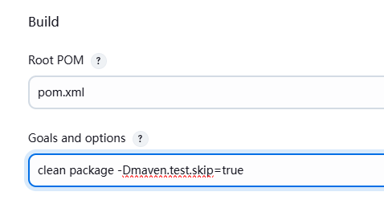
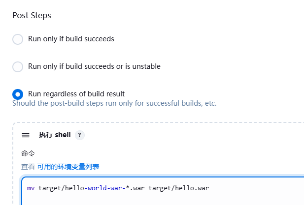

# Jenkins 部署与基本配置

Jenkins 只是一个调度平台,其本身并不能完成项目的构建部署 

Jenkins 需要安装各种插件,可能还需要编写Shell,python脚本等才能调用和集成众多的组件来实现复杂的 构建部署功能

## Jenkins 的安装

Jenkins支持多种安装方法 

*   包安装 
*   JAVA的WAR文件  
*   容器运行

系统要求 

最低推荐配置: 

*   256MB可用内存 
*   1GB可用磁盘空间(作为一个 docker容器运行jenkins的话推荐10GB)

为小团队推荐的硬件配置: 

*   1GB+可用内存 
*   50 GB+ 可用磁盘空间 

JAVA 软件配置: 

*   Java 8—无论是Java运行时环境（JRE）还是Java开发工具包（JDK）都可以。
*    Jenkins requires Java 11 or 17 since Jenkins 2.357 and LTS 2.361.1. 

### 系统准备

```shell
#设置语言环境，防止后期Jenkins汉化出问题
localectl set-locale LANG=en_US.UTF-8
```

###  JAVA 环境

 Jenkins requires Java 11 or 17 since Jenkins 2.357 and LTS 2.361.1. 


```shell
#安装openjdk
apt update && apt -y install openjdk-17-jdk
```

### 包安装 Jenkins

[Debian Jenkins Packages](https://pkg.jenkins.io/debian-stable/)

```
sudo wget -O /usr/share/keyrings/jenkins-keyring.asc \
https://pkg.jenkins.io/debian-stable/jenkins.io-2023.key

echo "deb [signed-by=/usr/share/keyrings/jenkins-keyring.asc]" \
    https://pkg.jenkins.io/debian-stable binary/ | sudo tee \
    /etc/apt/sources.list.d/jenkins.list > /dev/null
    
sudo apt-get update
sudo apt-get install fontconfig openjdk-17-jdk
sudo apt-get install jenkins
```

```shell
# 默认随机密码
cat /var/lib/jenkins/secrets/initialAdminPassword
```

### 基于 WAR 包直接部署

[War Jenkins Packages](https://get.jenkins.io/war-stable/)

```shell
wget https://get.jenkins.io/war-stable/xxx

java -jar  jenkins.war  --httpPort=9090
```

 ##  Jenkins 管理工具

jenkins 指供了Web 管理界面,也提供了命令行管理工具

```shell
http://jenkins.loong.com:8080/cli/
```

## Jenkins 插件管理及安装

[Jenkins Plugins](https://plugins.jenkins.io/)


插件安装目录

```shell
ls /var/lib/jenkins/plugins/
```


更改 Jenkins 的镜像源为国内镜像站

```shell
# 此修改只是临时性，服务重启后会自动还原
/var/lib/jenkins/updates/default.json

sed -i.bak 's#updates.jenkins.io/download#mirror.tuna.tsinghua.edu.cn/jenkins#g' /var/lib/jenkins/updates/default.json

sed -i 's#www.google.com#www.baidu.com#g'  /var/lib/jenkins/updates/default.json

# 如果是tomcat运行war包方式需要下面路径
/root/.jenkins/updates/default.json
```


```shell
# 将升级站点URL替换成下面国内镜像地址,提交后再次安装插件即可
#查看镜像源
http://mirrors.jenkins-ci.org/status.html
#默认镜像源
https://updates.jenkins.io/update-center.json
#国内镜像源
https://mirror.tuna.tsinghua.edu.cn/jenkins/updates/update-center.json
https://mirrors.aliyun.com/jenkins/updates/update-center.json
```

## Jenkins 优化配置

### SSH 优化

Jenkins 服务器做为一个CICD工具,后续会经常使用 ssh 协议连接远程主机,为方便连接,建议修改自动信 任远程主机,避免首次连接的人为输入yes的确认过程

方法1: web配置 系统管理 --  全局安全配置（需要安装插件）


方法2:  在 Jenkins 服务器修改 ssh的客户端配置文件

```shell
vim /etc/ssh/ssh_config
StrictHostKeyChecking no
#修改客户端配置无需重启ssh服务
```


### 性能优化

默认只能并行2个任务,建议根据CPU核心数,将执行者数量修改为CPU的核数


## Jenkins 的备份还原

```shell
# 主目录
/var/lib/jenkins

```


## 找回忘记的密码

```shell
systemctl stop jenkins

#删除jenkins主目录中config.xml的如下内容
vim /var/lib/jenkins/config.xml
################################################################################
  <useSecurity>true</useSecurity> 
  <authorizationStrategy 
class="hudson.security.FullControlOnceLoggedInAuthorizationStrategy"> 
    <denyAnonymousReadAccess>true</denyAnonymousReadAccess> 
  </authorizationStrategy> 
  <securityRealm class="hudson.security.HudsonPrivateSecurityRealm"> 
    <disableSignup>true</disableSignup> 
    <enableCaptcha>false</enableCaptcha> 
  </securityRealm> 
################################################################################

systemctl start jenkins 

# 重新无需验证即可登录，修改安全配置为Jenkins's own user database(Jenkins专有用户数据库),保存后
# 系统管理”,发现此时出现“管理用户”
# 点admin的配置，重新输入两次新密码
# 系统管理--- 全局安全配置 --- 授权策略, 将任何用户可以做任何事(没有任何限制) 修改为登录用户可以做任何事

```

# Jenkins 实现 CICD

Jenkins 实现传统的 CICD 流程


Docker 环境的CICD


Kubernetes 环境的 CICD


Jenkins 架构


## 前期准备

jenkins服务器

下载Gitlab 相关的插件

重启jenkins

### 添加基于用户名和密码类型的凭据

如果基于http协议则无需实现ssh key 凭证,而选择添加gitlab用户名和密码的形式


### 创建基于 ssh key 的凭据

```shell
su - jenkins
jenkins@loong:~$ ssh-keygen  
jenkins@loong:~$ cat .ssh/id_ed25519.pub
# 到gitlab添加公钥
jenkins@loong:~$ cat .ssh/id_ed25519
```


```
到jenkins添加私钥
```

### 对生产环境与测试环境进行密钥认证

```shell
su - jenkins
jenkins@loong:~$ ssh-copy-id root@10.0.0.205
jenkins@loong:~$ ssh-copy-id root@10.0.0.206
```

###  Jenkins 全局工具配置 JDK 和 Maven

填写全局工具配置

全局工具中安装的工具在无需路径就可以Pipeline中直接调用，但在自由风格的shell中直接使用，会提 示路径找不到


## Freestyle(全静态网页)

使用http或ssh凭证

注意分支是master还是main

首次连接Gitlab服务器会弹出未知主机的警告，需要添加信任（前面优化有做）


开始构建

```shell
# 查看是否拉取
jenkins@loong:~$ ls /var/lib/jenkins/workspace/free-staticHTML
```

配置 Jenkins 结合 GitLab 实现自动化前端项目的部署和回滚

205，206启动nginx

**shell脚本实现**

```shell
HOST_LIST="
 10.0.0.205
 10.0.0.206
 "
 
APP=wheel
APP_PATH=/var/www/html
DATA_PATH=/opt
DATE=$(date +%F_%H-%M-%S)

deploy() {
    for i in ${HOST_LIST}; do
        ssh root@$i "rm -rf  ${APP_PATH} && mkdir -pv ${DATA_PATH}/${APP}-${DATE}"
        scp -r * root@$i:${DATA_PATH}/${APP}-${DATE}
        ssh root@$i "ln -sv ${DATA_PATH}/${APP}-${DATE} ${APP_PATH}"
    done
}

rollback() {
    for i in ${HOST_LIST}; do
        CURRENT_VERISION=$(ssh root@$i "readlink $APP_PATH")
        CURRENT_VERISION=$(basename ${CURRENT_VERISION})
        echo ${CURRENT_VERISION}
        PRE_VERSION=$(ssh root@$i "ls -1 ${DATA_PATH} | grep -B1 ${CURRENT_VERISION}|head -n1 ")
        echo $PRE_VERSION
        ssh root@$i "rm -f  ${APP_PATH}&& ln -sv ${DATA_PATH}/${PRE_VERSION} ${APP_PATH}"
    done
}

case $1 in
deploy)
    deploy
    ;;
rollback)
    rollback
    ;;
*)
    exit
    ;;
esac

```

在Jenkins中引用脚本


修改代码再上传重新构建

使用`bash -x /data/jenkins-scripts/staticHTML.sh rollback`回退

**参数化构建,实现部署与回滚选项**


## 自由风格的任务构建基于 Spring Boot 的 JAR 包 JAVA 项目

**git parameter 插件安装**


 **Jenkins 服务器上安装 maven**

```
apt  -y install maven
```

目标服务器上安装java

shell脚本

```shell
APP=helloworld-spring-boot
APP_PATH=/data/${APP}
HOST_LIST="
 10.0.0.202
 10.0.0.203
 "
PORT=8888
mvn clean package -Dmaven.test.skip=true
for host in $HOST_LIST; do
    ssh root@$host "[ -e $APP_PATH ] || mkdir -p $APP_PATH"
    ssh root@$host killall -9 java &>/dev/null
    scp target/${APP}-*-SNAPSHOT.jar root@$host:${APP_PATH}/${APP}.jar
    #ssh root@$host "java -jar ${APP_PATH}/${APP}.jar --server.port=8888 &"
    ssh root@$host "nohup java -jar  ${APP_PATH}/${APP}.jar --server.port=$PORT &>/dev/null & " &
done
```


## Maven 风格的任务构建基于WAR包运行 Tomcat服务器 JAVA 项目

[hello-world-war: hello-world-war](https://gitee.com/lbtooth/hello-world-war)

安装 tomcat

```shell
apt install tomcat10  #openjdk17
```

 Jenkins 安装 Maven 和 Tomcat 两个插件


创建 Maven 风格的任务

输入maven的编译选项



Post Steps 的shell 脚本



#### 使用插件

需要开启tomcat的网页管理功能

与创建对应的账号


#### 使用shell脚本

```shell
APP=hello-world-war
APP_PATH=/var/lib/tomcat10/webapps

HOST_LIST="
 10.0.0.205
 10.0.0.206
 "
mvn clean package -Dmaven.test.skip=true
for host in $HOST_LIST; do
    ssh root@$host systemctl stop tomcat10
    scp target/${APP}-*.war root@$host:${APP_PATH}/hello.war
    ssh root@$host systemctl start tomcat10
done

```

## 实现 Golang 应用源码编译并部署

[ginweb: golang gin web example](https://gitee.com/lbtooth/ginweb)

在Jenkins 安装 Golang 环境

```
apt -y install golang
go version
```

准备数据库环境

10.0.0.207

```shell
apt -y install mysql-server redis 

# mysql配置
vim /etc/mysql/mysql.conf.d/mysqld.cnf
bind-address        = 0.0.0.0                             
#mysqlx-bind-address    = 127.0.0.1

mysql
mysql> create database ginweb;
mysql> create user ginweb@'10.0.0.%' identified by '123456';
mysql> grant all on ginweb.* to ginweb@'10.0.0.%';

systemctl restart mysql.service

#导入表结构
mysql -uginweb -p123456 -h10.0.0.207 ginweb < ginweb.sql

# reides配置
vim /etc/redis/redis.conf
#bind 127.0.0.1 -::1
bind 0.0.0.0
requirepass 123456 

systemctl restart redis
```

更改git中的conf重新推送

```shell
vim conf/ginweb.ini
```

**部署的shell脚本**

```shell
APP=ginweb
APP_PATH=/data
DATE=$(date +%F_%H-%M-%S)
HOST_LIST="
 10.0.0.205
 10.0.0.206
 "
build() {
    #go env 可以查看到下面变量信息，如下环境变量不支持相对路径，只支持绝对路径
    #root用户运行脚本
    #export GOCACHE="/root/.cache/go-build"
    #export GOPATH="/root/go"
    #Jenkins用户运行脚本
    export GOCACHE="/var/lib/jenkins/.cache/go-build"
    export GOPATH="/var/lib/jenkins/go"
    #go env -w GOPROXY=https://goproxy.cn,direct
    export GOPROXY="https://goproxy.cn,direct"
    CGO_ENABLED=0 go build -o ${APP}
}
deloy() {
    for host in $HOST_LIST; do
        ssh root@$host "mkdir -p $APP_PATH/${APP}-${DATE}"
        scp -r * root@$host:$APP_PATH/${APP}-${DATE}/
        ssh root@$host "killall -0 ${APP} &> /dev/null  && killall -9 ${APP}; rm -f ${APP_PATH}/${APP} && \
                        ln -s ${APP_PATH}/${APP}-${DATE} ${APP_PATH}/${APP}; \
                        cd ${APP_PATH}/${APP}/ && nohup ./${APP}&>/dev/null" &
    done
}

build
deloy
```

## 集成 Ansible 的任务构建


jenkins服务器安装 Ansible 环境

```shell
apt -y install ansible
ansible --version

mkdir -p /etc/ansible/ && touch /etc/ansible/ansible.cfg

#准备主机清单文件
vim /etc/ansible/hosts
[webservers]
10.0.0.205  ansible_ssh_user=root
[appservers]
10.0.0.206  ansible_ssh_user=root
```

安装 Ansible 插件

