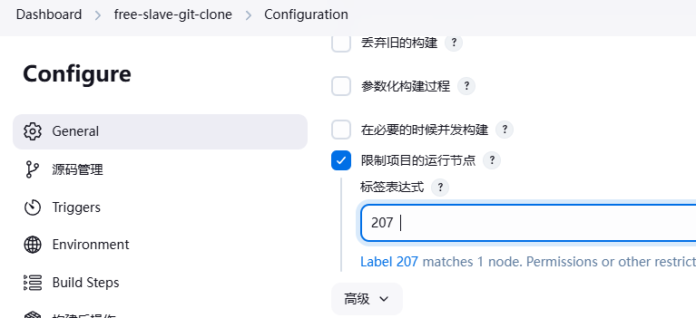
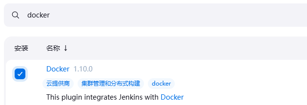
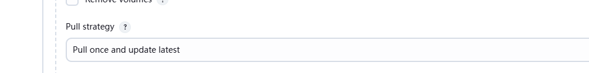
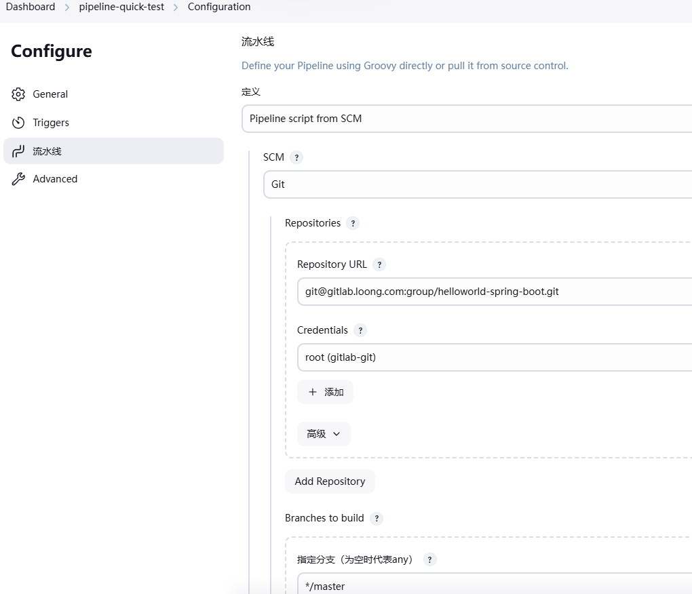

# Jenkins 分布式

##  Jenkins 分布式说明


在众多 Job 的场景下，单台 Jenkins Master 同时执行代码 clone、编译、打包及构建，其性能可能会出 现瓶颈从而会影响代码部署效率

Jenkins官方提供了 Jenkins 分布式构建，将众多job分散运行到不同的 Jenkins slave节点，大幅提高并 行job的处理能力。除此之外,还可以针对不同的开发环境分配至不同的Slave实现编译部署

主节点负责提供UI、处理HTTP请求及管理构建环境等，而代理节点则主要负责执行构建任务

*   主节点Master/Controller: 

    Jenkins的一个部署实例的核心控制系统，它能够完全访问所有Jenkins配置的选项和任务（job)列 表，而且，若不存在其他代理节点，主节点也是默认的任务执行节点

*   代理节点Slave/Agent:

    在早先版本的Jenkins中，代理节点 (agent)也被称为从节点(slave),它代表着所有的非主节点

    这类节点由主节点管理，按需分配或指定执行特定的任务，例如不同的构建任务或测试

    脚本式流水线中,节点特指一个运行代理节点的系统,而在声明式流水线中,它则是分配的一个作为代 理节点的特定节点

*   执行器（Executor):

    Executor只是节点或代理节点用于执行任务的一个糟位

Executor的数量定义了该节点可以执行的并发任务量，一个节点上可以有任务数量的糟位，但也允行管 理员按节点资源定义合适的数量

在主节点将任务分配给特定节点时，该节点上必须有可用的Executor来立即执行该任务,否则、只能等 到有空闲槽位可用


### Jenkins 主从架构图


### 节点标签 Label

Jenkins中的标签(tag)指的是节点上的标识符，而后可由pipeline中的agent指令等进行过滤和选择节点 执行

当Agent节点较多时，基于方便管理的目的，通常应该给这些节点添加能够体现其某种特性或功能的标 签，以便于在构建任务中能基于标签过滤出符合条件的agent来

一个 Agent 上可添加多个标签,一个标签也可以添加至多个 Agent, 可以在作业中通过标签表达式实现 Agent的过滤

### Jenkins Master 与 Agent之间的通信方式


*   Launch agent via SSH

    此方式需要安装SSH Build Agents插件

    *   方式1: 

        在Controller端保存认证信息为Credential,可以口令认证和密钥认证

        运行者身份：普通用户jenkins，/home/jenkins/agent目录，作为Agent端的工作目录

        Controller ssh client --> Agent ssh server 

    *   方式2: 

        通过基于 jenkins/ssh-agent 镜像的容器运行

        此方式只支持密钥认证

        使用ssh-keygen生成一对密钥，并将公钥通过环境变量传递给 ssh-agent容器

        将私钥保存为 Jenkins上的凭据

*   Launch agent by connecting it to the controller

    基于JNLP-HTTP 协议连接器实现

    在agent上以手动或系统服务的方式经由JNLP协议触发双向连接的建立

    Controller jnlp server <-- Agent jnlp client

*   Launch agent via execution of command on the controller

    在Controller上远程运行命令启动Agent

    在Master 上以远程运行命令的方式启动Agent,需要ssh服务

### Agent 分类

**静态Agent：**

固定的持续运行的Agent,即使没有任务,也需要启动Agent 

以daemon形式运行的Jenkins

每个Agent可以存在多个Executor，具体的数量应该根据Agent所在主机的系统资源来设定


**动态Agent：**

按需动态创建和删除 Agent ,当无任务执行时,删除Agent

可以基于Docker 和 Kubernetes 实现

## 实战案例: 基于 SSH 协议实现 Jenkins 分布式


Slave 节点安装 Java 等环境确保和 Master 环境一致

Slave 节点通过从Master节点自动下载的基于 JAVA 的 remoting.jar 程序包实现,所以需要安装JDK

```shell
apt install openjdk-17-jdk

#创建数据目录,可以不创建,会自动创建（可选）
mkdir -p /var/lib/jenkins

#如果需要执行特定任务,还需要安装相关的工具
apt -y install git maven golang ansible

# 名称解析要和jenkins服务器一致

#生成ssh key,并复制公钥到Gitlab的相关联的用户
ssh-keygen
cat .ssh/id_rsa.pub

# 如果需要和其它主机基于SSH key连接,还需复制公钥到其它主机
ssh-copy-id 10.0.0.205
ssh-copy-id 10.0.0.206
```

### Master 节点安装插件

安装 SSH Build Agents 插件，实现 ssh 连接代理

### Master 节点配置ssh连接的自动信任主机


或

修改agent 上面ssh客户端配置文件

```shell
vim /etc/ssh/ssh_config
StrictHostKeyChecking no
```

### 添加 Master 访问 Slave 认证凭据

可以是用户密码的凭据


### 添加 Slave 节点

注意: 主从节点的时间要同步

Jenkins—系统管理—节点管理—新建节点


###  验证 Slave Web 状态


### 验证 Slave 进程状态

```shell
ps aux|grep jenkins
root       21727  6.5  4.7 3101616 93856 ?       Ssl  07:08   0:04 java -jar remoting.jar -workDir /var/lib/jenkins -jar-cache /var/lib/jenkins/remoting/jarCache
```

### 指定任务运行的节点

指定slave节点运行任务,可能会需要配置到gitlab服务和web服务器的ssh key验证

如果需要执行脚本,还需要复到jenkins服务器的脚本到slave节点



## 实战案例: 基于docker-compose 通过SSH 实现 Jenkins 分布式

```yaml
cat docker-compose.yaml
version: '3.6'

volumes:
  ssh_agent01_data: {}
  ssh_agent02_data: {}
networks:
  jenkins_net:
    driver: bridge
    ipam:
      config:
        - subnet: 172.27.0.0/24

services:
  ssh-agent01:
    image: jenkins/ssh-agent:jdk17
    hostname: ssh-agent01.loong.com
    #user: jenkins
    environment:
      TZ: Asia/Shanghai
      #JENKINS_AGENT_HOME: /home/jenkins
      JENKINS_AGENT_SSH_PUBKEY: ssh-rsa 
 AAAAB3NzaC1yc2EAAAADAQABAAABAQC6z4ELkY56/vIIhmCPNE2FolKlskP6OEsyGIfS3TVhHTpXOTjs
 c37C8BHo997rEIlyXGvPG36xQDd1dxsz2dz0Rs0e60iUsdT7JwQjLgW/6szX9W0EmNWiUz9od6Gt+onC
 C4jd9yK2zdDDc+E6ML5WihAGm7dmKU3l3FrBa1oYgDa6Jig/sL0Wl5+3gOJPzUrxX438FRkORVnDFEz3
 7Da8RUf+8vcI/6eQ5loUDp0/qTPpDqhC98He6JPwr31Jenx8ULdrsPZH5Og2KYX801aVpw6DTiC+uZm9
 gyw1ysqSGCXgBkrh/IB9rdvl3szzWseLZg+Nj84j1d3LUN/oXj1N
 # SSH PRIVATE KEY and PUBLIC KEY 需要手动生成,利用private key 创建凭据,此处写入 public key
    networks:
      jenkins_net:
        ipv4_address: 172.27.0.21
        aliases:- ssh-slave01- ssh-agent01
    ports:
      - "22022:22"
    #restart: always

  ssh-agent02:
    image: jenkins/ssh-agent:jdk17
    hostname: ssh-agent02.loong.com
    #user: jenkins
    environment:
      TZ: Asia/Shanghai
      #JENKINS_AGENT_HOME: /home/jenkins
      JENKINS_AGENT_SSH_PUBKEY: ssh-rsa 
 AAAAB3NzaC1yc2EAAAADAQABAAABAQC6z4ELkY56/vIIhmCPNE2FolKlskP6OEsyGIfS3TVhHTpXOTjs
 c37C8BHo997rEIlyXGvPG36xQDd1dxsz2dz0Rs0e60iUsdT7JwQjLgW/6szX9W0EmNWiUz9od6Gt+onC
 C4jd9yK2zdDDc+E6ML5WihAGm7dmKU3l3FrBa1oYgDa6Jig/sL0Wl5+3gOJPzUrxX438FRkORVnDFEz3
 7Da8RUf+8vcI/6eQ5loUDp0/qTPpDqhC98He6JPwr31Jenx8ULdrsPZH5Og2KYX801aVpw6DTiC+uZm9
 gyw1ysqSGCXgBkrh/IB9rdvl3szzWseLZg+Nj84j1d3LUN/oXj1N
 # SSH PRIVATE KEY and PUBLIC KEY 需要手动生成,利用private key 创建凭据,此处写入 public key,和上面一样
    networks:
      jenkins_net:
        ipv4_address: 172.27.0.22
        aliases:- ssh-slave02- ssh-agent02
    ports:
      - "22122:22"
    #restart: always
```

利用容器做slave-agent

```shell
docker-compose up
```

创建slave节点时，连接ip是相同ip，但端口不同

如果使用基于ssh的git仓库gitlab 需要信任Gitlab主机

## 实战案例：基于 JNLP协议的 Java Web 启动代理

Launch agent by connecting it to the controller 也称为 通过 Java Web 启动代理 

此方式无需安装插件，即可实现

### Master节点开启连接端口

jenkins-v2.479.1 可以不打开端口，也可以实现JNLP

因为走的是http的8080

### 创建代理Agent节点


### slave节点连接

点击获取命令


```shell
curl -sO http://jenkins.loong.com:8080/jnlpJars/agent.jar
java -jar agent.jar -url http://jenkins.loong.com:8080/ -secret 115f265507f9fc719e218743fa4ac316e1cf68c8164190ab659b811b7fdc9514 -name "slave-207" -webSocket -workDir "/var/lib/jenkins "
```

## 实战案例：基于docker-compose实现通过JNLP协议的 Java Web 启动代理

master创建 Jenkins Agent

记录生成的name和secret


```yaml
version: '3.6'

volumes:
  agent01_data: {}
  agent02_data: {}

networks:
  jenkins_net:
    driver: bridge
    ipam:
      config:- subnet: 172.27.0.0/24
services:
  agent01:
    image: jenkins/inbound-agent:alpine-jdk11
    hostname: agent01.loong.com
    user: root
    environment:
      TZ: Asia/Shanghai
      JENKINS_URL: http://jenkins.loong.com:8080
      JENKINS_AGENT_NAME: jenkins-jnlp-agent01  #指定和Jenkins的Agent的名称相同
      JENKINS_AGENT_WORKDIR: /data/jenkins/
      JENKINS_SECRET: 3aef4f69d569d9f3b48e2daf91c3a80b1c8d8bcb310462859950dacc1b202cbc
      # 此处的JENKINS_SECRET需要用创建agent时生成的Secret替代
    volumes:
      - agent01_data:/data/jenkins/
    networks:
			      jenkins_net:
        ipv4_address: 172.27.0.11
        aliases:
          - slave01
          - agent01
    #extra_hosts:
    #  - "jenkins.wang.org:${JENKINS_HOST_IP}"
    #restart: always
  agent02:
    image: jenkins/inbound-agent:alpine-jdk11
    hostname: agent02.wang.org
    user: root
    environment:
      TZ: Asia/Shanghai
      JENKINS_URL: http://jenkins.loong.com:8080
      JENKINS_AGENT_NAME: jenkins-jnlp-agent02   
      JENKINS_AGENT_WORKDIR: /data/jenkins/
      JENKINS_SECRET: fb52f831107fd9a7de8051ca8aa506dc4836056231d21aab7e82138febf83231
      # SECRET is automatically generated by the master when adding agent02.
    volumes:
      - agent02_data:/data/jenkins/
    networks:
      jenkins_net:
        ipv4_address: 172.27.0.12
        aliases:
          - slave02
          - agent02
    #extra_hosts:
    #  - "jenkins.wang.org:${JENKINS_HOST_IP}"
    #restart: always
```

用容器代替主机

```
docker-compose up
```


## 基于Docker的动态Agent

有任务就创建容器，任务结束，容器释放

安装 Docker 插件



**docker镜像的jdk版本要与master的jdk版本一致**

否则g

### 创建 Cloud


### Docker Cloud Details 配置指定连接Docker的方式

打开TCP Port for inbound agents 的指定端口为50000端口


#### 方式1: 本地 socket文件

```shell
ll /var/run/docker.sock

#配置路径
unix:///var/run/docker.sock
```


#### 方式2: 远程方式


### 添加 Docker Agent templates

#### 使用JNLP协议

```shell
docker pull jenkins/inbound-agent:alpine-jdk17
docker pull jenkins/inbound-agent:alpine-jdk11

# 测试
docker run --rm  jenkins/inbound-agent:alpine-jdk17  env
```

在创建Cloud 云中指定模板


#### 使用ssh协议

```shell
docker pull jenkins/ssh-agent:jdk17
docker pull jenkins/ssh-agent:jdk11

docker run --rm  jenkins/ssh-agent:jdk11  env
```




#### 域名解析

主机配置了DNS解析，容器会继承

没有配置DNS解析服务器，要在模板中手动配置


### 指定任务运行的节点


#  Jenkins Pipeline

Pipeline 流水线，其实就是将之前的一个任务或者一个脚本就做完的工作，用 Pipeline 语法划分 为多个子任务然后分别执行，两者实现的最终效果是一样的，但是由于原始任务划分为多个子任务之 后，以流水线的方式来执行，那么就可以随时查看任意子任务的执行效果，即使在某个阶段出现问题， 我们也可以随时直接定位问题的发生点，大大提高项目的效率,即模块化完成复杂任务的思想体现

Pipeline 是帮助 Jenkins 实现CI到CD转变的重要角色，是运行在 jenkins 2.X 版本的核心插件，简单来说  Pipeline就是一套运行于 Jenkins上的工作流框架，将原本独立运行于单个或者多个节点的任务连接起 来，实现单个任务难以完成的复杂发布流程，从而实现单个任务很难实现的复杂流程编排和任务可视化

Pipeline基于Groovy DSL(领域特定语言Domain Specific Language )实现，任何发布流程都可以表述为 一段Groovy脚本。


## Pipeline 优势


一致性:   Pipeline 用统一语法的代码的方式实现各个CICD的阶段的任务，不仅可以被纳入版本控制，还 可以通过编辑代码实现目标效果

直观性:   构建过程中每一步都可以直接的图形化显示输出,比如每个阶段的执行时间,直观友好,pipeline  帮助我们快速的定位哪个阶段的任务出现错误

可持续性：Jenkins的重启或者中断后不影响已经执行的pipeline Job 

支持暂停：Pipeline可以选择停止并等待人工输入或批准后再继续执行 

支持回放:   如果失败,可以使用回放,进行临时性的修改 job ,再调试执行,如果成功,再真正修改任务即可 

可扩展：通过Groovy的编程更容易的扩展插件 

并行执行：通过Groovy脚本可以实现step，stage间的并行执行，和更复杂的相互依赖关系 

多功能：支持复杂CD要求，包括fork/join子进程，条件判断，循环和并行执行工作的能力

## Pipeline 语法

[Pipeline Syntax](https://www.jenkins.io/doc/book/pipeline/syntax/)

[流水线语法](https://www.jenkins.io/zh/doc/book/pipeline/syntax/)

Jenkins 内置语法帮助

```shell
http://jenkins-server:8080/job//pipeline-syntax/
#注意：需要安装pipeline插件并且是pipeline风格的任务
# 将自由风格转化成pipeline语法
```

当前 Jenkins 2.X 支持两种语法的流水线： 脚本式（命令式）和声明式

*   脚本式Scripted Pipeline语法

    此语法是 Jenkins最先支持pipeline语法，采用命令式风格，直接在流水线脚本中定义逻辑和程序流 程

    淘汰中，开头是 node {}

*   声明式Declarative Pipeline语法

    推荐使用，开头是 pipeline{}

声明式基本语法

```shell
pipeline {
    agent any 
    environment{
	        url='http://www.wangxiaochun.com'
    }
    
    stages {
        stage('Source') {
            steps {
                // 
                echo "Access ${url}"
            }
        }
        
        stage('Build') { 
            steps {
                // 
            }
        }
        
        stage('Test') { 
            steps {
                // 
            }
        }
        
        stage('Deploy') { 
            steps {
                // 
            }
        }
    }
}
```

### 变量


## 安装Pipeline 插件


## Pipeline Job

### 简单 Pipeline Job

```groovy
pipeline {
    agent any

    stages {
        stage('clone') {
            steps {
                echo 'clone'
            }
        }
        stage('build') {
            steps {
                echo 'build'
            }
        }
        stage('test') {
            steps {
                echo 'test'
            }
        }
        stage('image') {
            steps {
                echo 'image'
            }
        }        
    }
}
```

### 自动生成拉取代码的 Pipeline 脚本

jenkins的credential的唯一标识符

```shell
pipeline {
    agent any
	    
	    environment {
        codeRepo="git@gitlab.loong.com:group/helloworld-spring-boot.git"
        credential="gitlab-ssh"
    }
    
    stages {
        stage('Source') {
            steps {
                git branch: 'master', credentialsId: "${credential}", url: "${codeRepo}"
            }
        }
        stage('build') {
            steps {
                echo 'build'
            }
        }
        stage('test') {
            steps {
                echo 'test'
            }
        }
        stage('image') {
            steps {
                echo 'image'
            }
        }
    }
}
```

### Pipeline 部署示例

```groovy
pipeline {
    agent any
	    
	    environment {
        codeRepo="git@gitlab.loong.com:group/helloworld-spring-boot.git"
        credential="gitlab-ssh"
        harborServer='harbor.loong.com'
        projectName='spring-boot-helloworld'
        imageUrl="${harborServer}/public/${projectName}"
        imageTag="${BUILD_ID}"
        harborUserName="admin"
        harborPassword="123456"
    }
    
    stages {
        stage('Source') {
            steps {
                git branch: 'master', credentialsId: "${credential}", url: "${codeRepo}"
            }
        }
        stage('test') {
            steps {
                sh 'mvn test'
            }
        }
        stage('Build') {
            steps {
                //sh 'mvn -B -DskipTests clean package'
                 sh 'mvn clean package -Dmaven.test.skip=true'
            }
        }

        stage('Build Docker Image') {
            steps {
                sh 'docker build . -t "${imageUrl}:${imageTag}"'
            }           
        }
        stage('Push Docker Image') {
            steps {
                //sh "echo ${harborPassword} | docker login -u ${harborUserName} --password-stdin ${harborServer}"
                sh "docker login -u ${harborUserName} -p ${harborPassword} ${harborServer}"
                sh "docker push ${imageUrl}:${imageTag}"
            }   
        }
        stage('Run Docker ') {
            steps {
                sh 'ssh root@10.0.0.205 "docker rm -f ${projectName} ; docker run --name ${projectName} --restart always -p 80:8888 -d ${imageUrl}:${imageTag}"'
                sh 'ssh root@10.0.0.206 "docker rm -f ${projectName} ; docker run --name ${projectName} --restart always -p 80:8888 -d ${imageUrl}:${imageTag}"'
                //sh "docker -H 10.0.0.101 rm -f ${projectName} ; docker -H 10.0.0.101 run --name ${projectName} --restart always -p 80:8888 -d ${imageUrl}:${imageTag}"
                //sh "docker -H 10.0.0.102 rm -f ${projectName} ; docker -H 10.0.0.102 run --name ${projectName} --restart always -p 80:8888 -d ${imageUrl}:${imageTag}"
            }   
        }  		
    }
}
```


### 通过 Jenkinsfile 文件实现

可以将pipeline的语句写到代码仓库中的 Jenkinsfile 文件,这样更加方便维护




