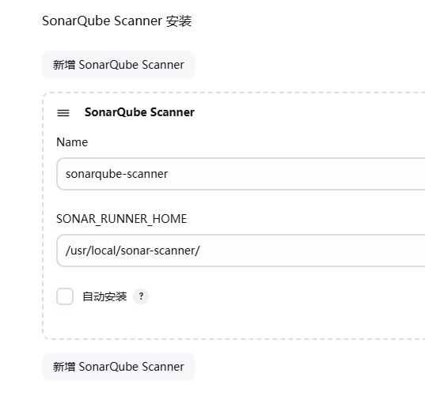

# SonarQube 架构

基于C/S结构


SonarQube Server 包括三个主要部分

*   Web Server: UI 界面
*   Search Server :为UI提供搜索功能,基于 ElasticSearch 实现
*   Compute Engine Server：处理代码分析报告,并将之存储到 SonarQube Database

SonarQube Database: 负责存储 SonarQube 的配置，以及项目的质量快照等

SonarQube Plugin: 可以在 SonarQube Server 安装丰富的插件，实现支持各种开发语言、SCM、 集成、身份验证和治理等功能

Code analysis Scanners: 代码扫描器,是SonarQube Server的**客户端**, 将代码扫描后得出报告提交 给 SonarQube Server

# 安装

## 要求

### 硬件要求

[Prerequisites and overview](https://docs.sonarsource.com/sonarqube-server/8.9/requirements/prerequisites-and-overview/)


### 系统内核优化

要求

```shell
#mv.max_map_count 用于限制一个进程可以拥有的VMA(虚拟内存区域)的数量,Ubuntu22.04默认值65530
sysctl -w vm.max_map_count=524288
#设置系统最大打开的文件描述符数
sysctl -w fs.file-max=131072
#每个用户可以打开的文件描述符数
ulimit -n 131072
#每个用户可以打开的线程数
ulimit -u 8192

# 24.04
sysctl -a | grep vm.max_map_count
vm.max_map_count = 1048576

sysctl -a | grep fs.file-max
fs.file-max = 9223372036854775807

vim /etc/security/limits.conf

# 更改
vim /etc/sysctl.conf
vm.max_map_count=1048576
fs.file-max=9223372036854775807 

vim /etc/security/limits.conf
sonarqube  -  nofile  131072
sonarqube  -  nproc   8192
root       -  nofile  131072
root       -  nproc   8192 
# 或者如果以systemd 运行SonarQube,需要在service文件配置
LimitNOFILE=131072
LimitNPROC=8192
```

### 数据库

注意：SonarQube 7.9 不再支持MySQL，可以选择安装 PostgreSQL

9.9


### Java 环境依赖

 SonarQube 7.9 以上版本不再支持 java 11

9.9


## 开始

[Download Previous SonarQube Server Versions | Sonar](https://www.sonarsource.com/products/sonarqube/downloads/historical-downloads/)

SonarQube 9.9.8 LTA

ubuntu24.04

### 创建SonarQube用户

```shell
#使用普通账户启动sonarqube,因为sonarqube内置了ES，所以不允许能root启动
useradd -s /bin/bash -m sonarqube 

root@loong:~# id sonarqube 
uid=1001(sonarqube) gid=1001(sonarqube) groups=1001(sonarqube)
```

### 安装和配置 PostgreSQL 数据库

查看SonarQube 版本支持的PostgreSQL数据库版本

SonarQube 9.9.8 LTA，安装PostgreSQL15

```shell
# 24.04只有16版本
apt list PostgreSQL
postgresql/noble-updates 16+257build1.1 all
```

pgSQL的镜像仓库

[Index of /pub/repos/apt/dists/noble-pgdg/15/binary-amd64/](https://apt.postgresql.org/pub/repos/apt/dists/noble-pgdg/15/binary-amd64/)

```shell
sudo apt install curl ca-certificates
sudo install -d /usr/share/postgresql-common/pgdg
sudo curl -o /usr/share/postgresql-common/pgdg/apt.postgresql.org.asc --fail https://www.postgresql.org/media/keys/ACCC4CF8.asc

sudo sh -c 'echo "deb [signed-by=/usr/share/postgresql-common/pgdg/apt.postgresql.org.asc] https://apt.postgresql.org/pub/repos/apt $(lsb_release -cs)-pgdg main" > /etc/apt/sources.list.d/pgdg.list'
sudo apt update

sudo apt install -y postgresql-15

# 配置
vim /etc/postgresql/15/main/postgresql.conf
listen_addresses = '*'

#开启远程访问（如果sonarqube和PostgreSQL在同一台主机，可不做修改）
vim /etc/postgresql/15/main/pg_hba.conf
host    all             all             0.0.0.0/0               scram-sha-256

systemctl restart postgresql
```

创建数据库和用户授权

```shell
#使用postgres用户登录（PostgresSQL安装后会自动创建postgres用户）
su - postgres

psql -U postgres

#安全起见,修改数据库管理员postgres用户的密码,可选
ALTER USER postgres WITH ENCRYPTED PASSWORD '123456';

CREATE USER sonarqube WITH ENCRYPTED PASSWORD '123456';
CREATE DATABASE sonarqube;
GRANT ALL PRIVILEGES ON DATABASE sonarqube TO sonarqube;
ALTER DATABASE sonarqube OWNER TO sonarqube;

# 检查
\l
\q
```

### 下载 SonarQube 和修改配置文件

```shell
wget https://binaries.sonarsource.com/Distribution/sonarqube/sonarqube-9.9.8.100196.zip

unzip sonarqube-9.9.8.100196.zip

mv /root/sonarqube-9.9.8.100196 /sonarqube

ln -sv /sonarqube /usr/local/sonarqube

chown -R sonarqube: /usr/local/sonarqube/
```

配置 SonarQube 连接数据库

```shell
vim /usr/local/sonarqube/conf/sonar.properties
sonar.jdbc.username=sonarqube
sonar.jdbc.password=123456
sonar.jdbc.url=jdbc:postgresql://localhost/sonarqube
```

启动

```shell
su - sonarqube
/usr/local/sonarqube/bin/linux-x86-64/sonar.sh start

psql -U sonarqube
\c sonarqube
\dt
# 查看9000端口是否起来
ss -tnulp
```

无法启动的主要的可能原因

*   用户和权限 
*   java 版本不对或没有安装 
*   内核参数没有优化 
*   数据库及权限

创建服务文件

```shell
su - sonarqube
/usr/local/sonarqube/bin/linux-x86-64/sonar.sh stop
exit

vim  /lib/systemd/system/sonarqube.service
[Unit]
Description=SonarQube service
After=syslog.target network.target
[Service]
Type=simple
User=sonarqube
Group=sonarqube
PermissionsStartOnly=true
ExecStart=/bin/nohup /usr/bin/java -Xms32m -Xmx32m -Djava.net.preferIPv4Stack=true -jar /usr/local/sonarqube/lib/sonar-application-9.9.8.100196.jar
StandardOutput=syslog
LimitNOFILE=131072
LimitNPROC=8192
TimeoutStartSec=5
Restart=always

[Install]
WantedBy=multi-user.target

systemctl daemon-reload 
systemctl start sonarqube.service
```

http://10.0.0.207:9000/

admin

admin

# 管理 SonarQube 服务器

## 账号

可安装中文插件

在SonarQube上创建用户账号（不建议使用admin账号）

Administration →security →user


为用户账号赋予相应的权限，例如执行分析和置备项目

Administration →security →Global Permissions


生成令牌 token


```shell
squ_9765a2c6766a09735639dcc006583d45378b3a6c
```

## SonarQube 质量阈

对代码质量检查的规则


# 部署代码扫描器 sonar-scanner

sonar-scanner 是基于Java 实现的客户端工具，负责扫描源代码，并提交结果给Sonarqube Server

根据上面创建用户和token信息修改sonar-scanner的配置文件


## 在 Jenkins 服务器部署和配置 sonar-scanner

[SonarScanner](https://docs.sonarsource.com/sonarqube-server/9.9/analyzing-source-code/scanners/sonarscanner/)

```shell
wget https://binaries.sonarsource.com/Distribution/sonar-scanner-cli/sonar-scanner-cli-7.0.2.4839-linux-x64.zip

unzip sonar-scanner-cli-7.0.2.4839-linux-x64.zip

mv /root/sonar-scanner-7.0.2.4839-linux-x64 /sonar-scanner
ln -s /sonar-scanner /usr/local/sonar-scanner
ln -s /usr/local/sonar-scanner/bin/sonar-scanner /usr/local/bin/

sonar-scanner  -v
```

配置

```shell
vim /usr/local/sonar-scanner/conf/sonar-scanner.properties
sonar.host.url=http://10.0.0.207:9000
sonar.sourceEncoding=UTF-8

sonar.login=squ_9765a2c6766a09735639dcc006583d45378b3a6c
```

## 在 Jenkins 全局tools中自动安装sonar-scanner

安装插件 SonarQube Scanner

后

可以在Jenkins中 管理-- 工具tools  直接安装

如何使用，见文档

# 准备测试代码和配置文件

sonar-scanner 扫描的代码需要提前在项目的根目录下准备名称为sonar-project.properties的文件，内 容如下

```shell
# 项目的唯一标识
# 必要项
sonar.projectKey=helloworld-spring-boot

#项目的名称,用于显示在 sonarqube web 界面
sonar.projectName=helloworld-spring-boot

#项目版本
sonar.projectVersion=1.0

#项目源码所在目录
sonar.sources=.

#排除扫描的目录
sonar.exclusions=**/test/**,**/target/**

#项目源码编译生成的二进制文件路径，./target默认没有会报错，可以手动创建
#sonar.java.binaries=./target
sonar.java.binaries=.

#编程语言
sonar.language=java

#编码格式
sonar.sourceEncoding=UTF-8
```

[SonarSource/sonar-scanning-examples: Shows how to use the Scanners](https://github.com/SonarSource/sonar-scanning-examples)

```shell
# 项目下
sonar-scanner
# 或
sonar-scanner -Dsonar.projectName=myapp -Dsonar.projectKey=myapp -Dsonar.sources=./ -Dsonar.java.binaries=./ 
-Dsonar.login=<token>
```


#  Jenkins 和 SonarQube 集成实现代码扫描


*   Jenkins Pipeline启动 
*   SonarQube Scanner分析代码,并将报告发送至SonarQubeServer 
*   SonarQube Server分析代码检测的结果是否符合预定义的质量阈 
*   SonarQube Server将通过(passed)或者失败（failed)的结果发送回Jenkins上的SonarQube  Scanner插件暴露的 Webhook
*    质量阈相关的阶段成功通过或可选地失败时Jenkins pipeline继续后面的Stage,否则pipeline将终止

## Jenkins 安装 SonarQube Scanner 插件实现代码扫描

### 在SonarQube添加Jenkins的回调接口


```shell
http://jenkins.loong.com:8080/sonarqube-webhook

# 此密码只用于防止攻击使用, 所以可以随意输入
openssl rand -base64 21
或
openssl rand -hex 15
6c9cf65cae3ca9aef38128a0d361a4
```

### Jenkins 安装 SonarQube Scanner 插件


 系统配置中添加 SonarQuebe Server 的地址和验证令牌


### Jenkins 添加 Sonar Scanner 扫描器

手动指定 sonar-scanner 在本地安装的绝对路径



指定下载路径自动安装

或

自动安装

## free风格


# 基于 PipeLine 实现 JAVA项目集成 SonarQube 代码检测通知 Jenkins


```groovy
pipeline {
    agent any
    tools {
        maven 'maven-3.8.7'
    }
    environment {
        codeRepo="git@gitlab.loong.com:group/helloworld-spring-boot.git"
        credential='gitlab-ssh'    
        harborServer='harbor.loong.com'
        projectName='spring-boot-helloworld'
        imageUrl="${harborServer}/private/${projectName}"
        imageTag="${BUILD_ID}"
    }
    stages {
        stage('Source') {
            steps {
                git branch: 'master', credentialsId: "${credential}", url: "${codeRepo}"
            }
        }
        stage('Test') {
            steps {
                sh 'mvn test'
            }
        }        
        stage("SonarQube Analysis") {
            steps {
                withSonarQubeEnv('SonarQube-server') {
                    sh 'mvn sonar:sonar'
                    //sh 'mvn sonar:sonar -Dsonar.java.binaries=./'
                }
            }
        }
        stage("Quality Gate") {
            steps {
                timeout(time: 3, unit: 'MINUTES') {
                    waitForQualityGate abortPipeline: true
                }
            }
        }	
        
        stage('Build') {
            steps {
                //sh 'mvn -B -DskipTests clean package'
                sh 'mvn -Dmaven.test.skip=true clean package'
            }
        }

        stage('Build Docker Image') {
            steps {
                sh 'docker image build . -t "${imageUrl}:${imageTag}"'
                // input(message: '镜像已经构建完成，是否要推送？')
            }           
        }
        stage('Push Docker Image') {
            steps {
                withCredentials([usernamePassword(credentialsId: 'harbor-admin', passwordVariable: 'harborPassword', usernameVariable: 'harborUserName')]) {
                    sh "docker login -u ${env.harborUserName} -p ${env.harborPassword} ${harborServer}"
                    sh "docker image push ${imageUrl}:${imageTag}"
                }
            }   
        }
        stage('Run Docker') {
            steps {
                //sh 'ssh root@10.0.0.101 "docker rm -f ${projectName} && docker run --name ${projectName} -p 80:8888 -d ${imageUrl}:${imageTag}"'
                //sh 'ssh root@10.0.0.102 "docker rm -f ${projectName} && docker run --name ${projectName} -p 80:8888 -d ${imageUrl}:${imageTag}"'
                sh "docker -H 10.0.0.205:2375 rm -f ${projectName} && docker -H 10.0.0.205:2375 run --name ${projectName} -p 80:8888 -d ${imageUrl}:${imageTag}"
                sh "docker -H 10.0.0.206:2375 rm -f ${projectName} && docker -H 10.0.0.206:2375 run --name ${projectName} -p 80:8888 -d ${imageUrl}:${imageTag}"
            }   
        }         
    }
    post {
        success {
            mail to: 'root@wangxiaochun.com',
            subject: "Status of pipeline: ${currentBuild.fullDisplayName}",
            body: "${env.BUILD_URL} has result ${currentBuild.result}"
        }
        failure{
            qyWechatNotification failNotify: true, webhookUrl: 'https://qyapi.weixin.qq.com/cgi-bin/webhook/send?key=938039da-1123-4862-b47b-f0396020f45b'
        }
    } 
}
```

