# DevOps 简介

## 传统开发模型

软件开发生命周期SDLC (Software Development Life Cycle)由计划,分析,设计,实现,测试集成和维护组 成

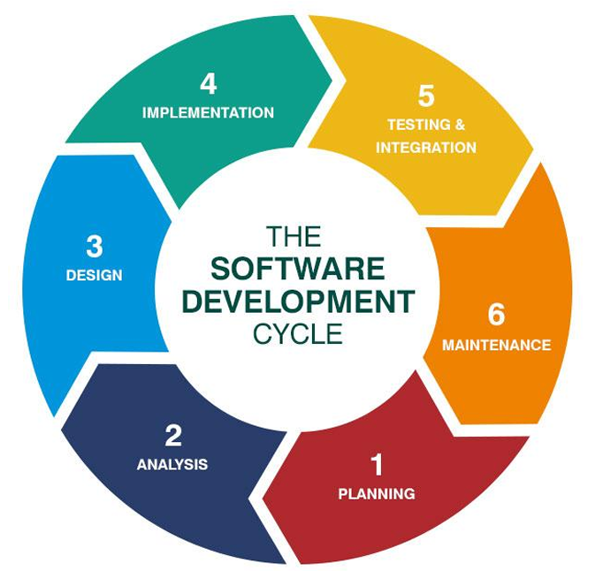

### 瀑布模型

瀑布模型是早期实现的开发模型,是一个级联SDLC模型，其中开发过程看起来像制造业的流水线，一步 一步地进行分析，预测，实现，测试，实施和支持阶段。

该SDLC模型包括完全逐步执行每个阶段。该过程严格记录并预定义，具有该软件开发生命周期模型的每 个阶段所期望的功能。

类似工厂中流水线的传送带，加工的产品只能按照一道一道的工序向下不断前进，不能后退。

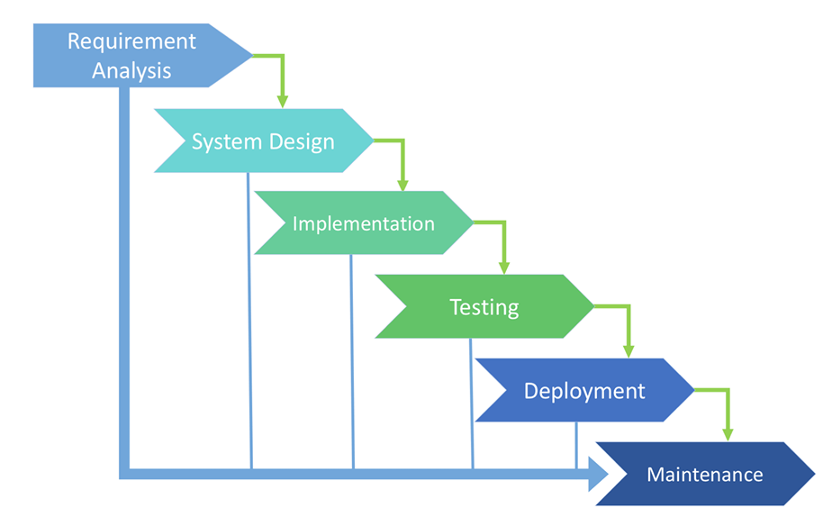

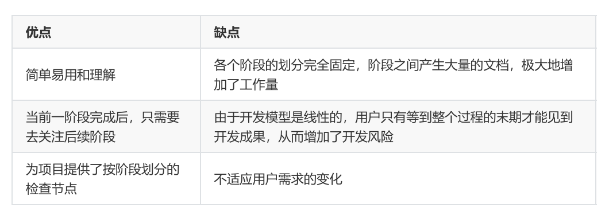

### V 形模型

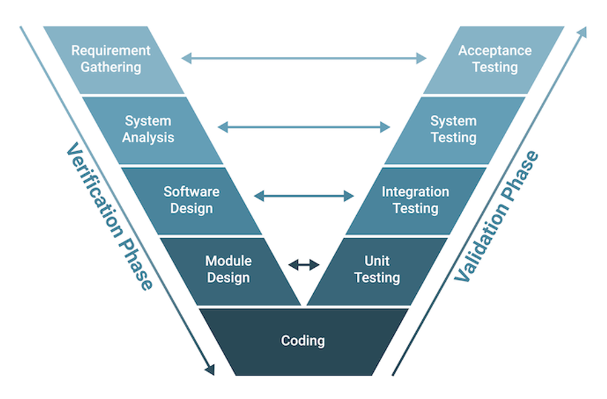

### 敏捷开发

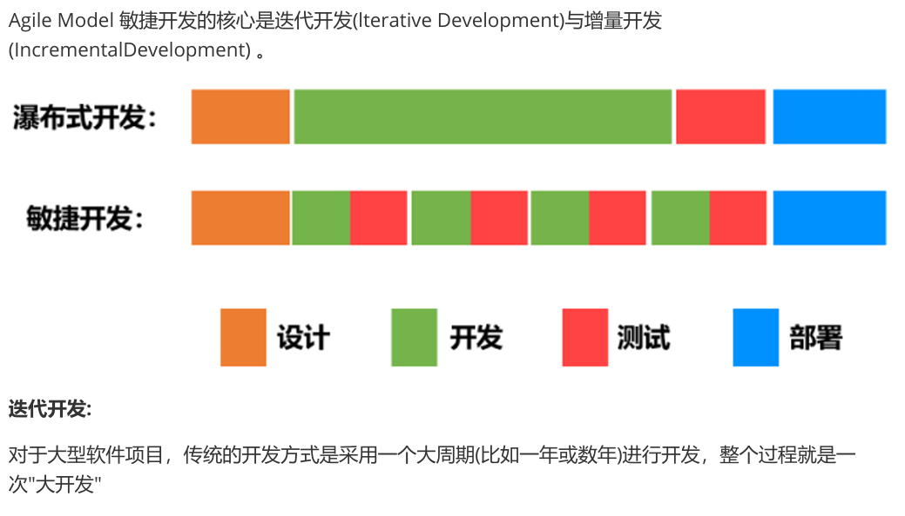


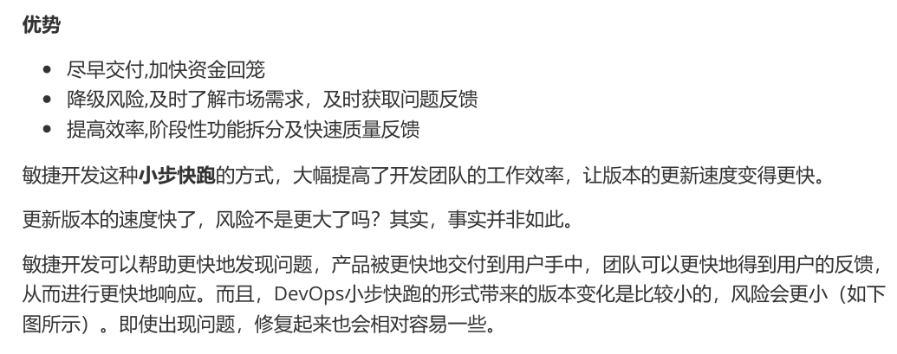

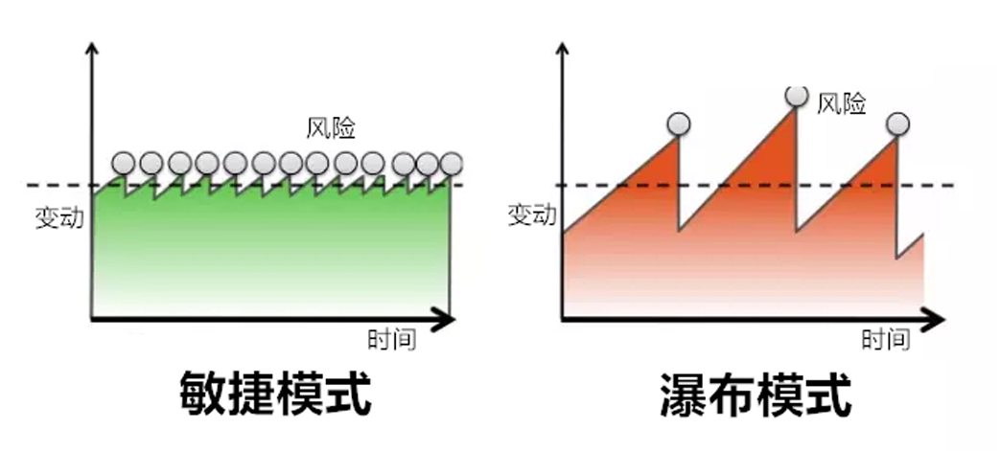

##  DevOps 介绍

DevOps 即开发 Development 和 Operations运维的缩写

DevOps是一组过程、方法与系统的统称，用于促进开发、技术运营和质量保障（QA）部门之间的沟 通、协作与整合。

DevOps 是针对开发人员、运维人员和测试人员的一种工作理念，是软件在应用开发、代码部署和质量 测试等整条生命周期中协作和沟通的最佳实践

DevOps 强调整个组织的所有相关部门的紧密合作以及交付和基础设施变更的自动化、从而实现持续集 成、持续部署和持续交付的目标

DevOps 强调团队协作、相互协助、持续发展，实现团队作战，即无论是开发、运维还是测试，都为了 最终的代码发布、持续部署和业务稳定而付出各自的努力，从而实现产品设计、开发、测试和部署的良 性循环，实现产品的最终持续交付。

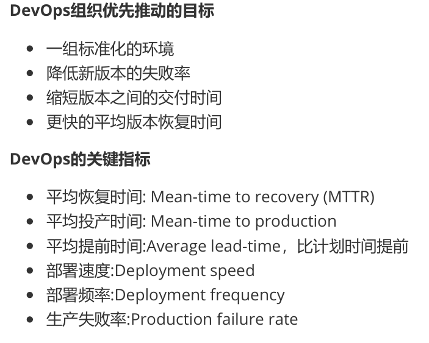

DevOps 有多个不同的阶段：计划，构建，持续集成，部署，运维，持续反馈

在思维和流程改变的同时，想要充分落地DevOps，当然离不开软件和平台的支持。目前支持DevOps的 软件很多了。

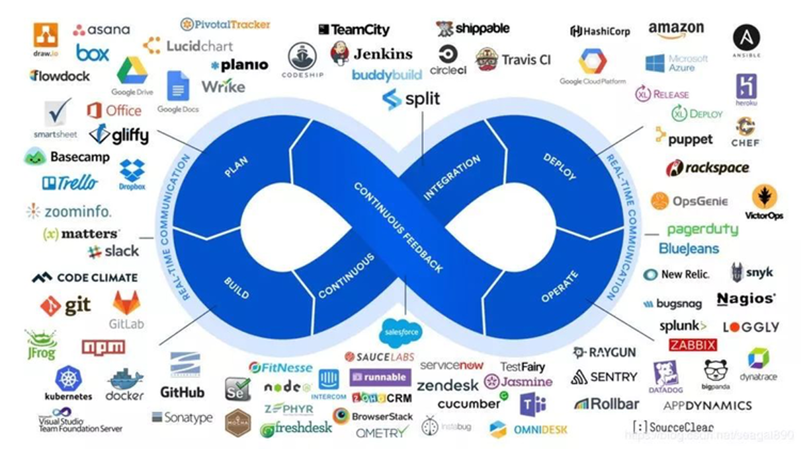

DevOps 涉及的四大相关平台

*   项目管理：如：Jira,禅道 
*   代码托管：如：Gitlab,SVN 
*   持续交付：如：Jenkins,Gitlab 
*   运维平台：如：腾讯蓝鲸,Spug等

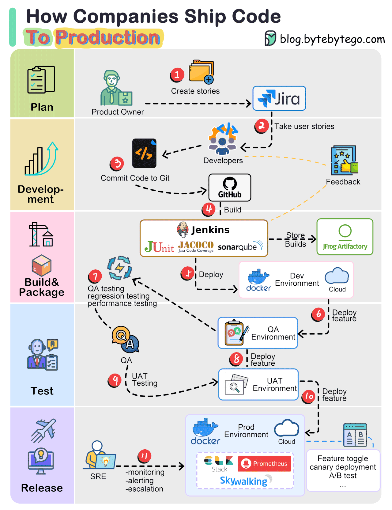

## DevOps 和 NoOps

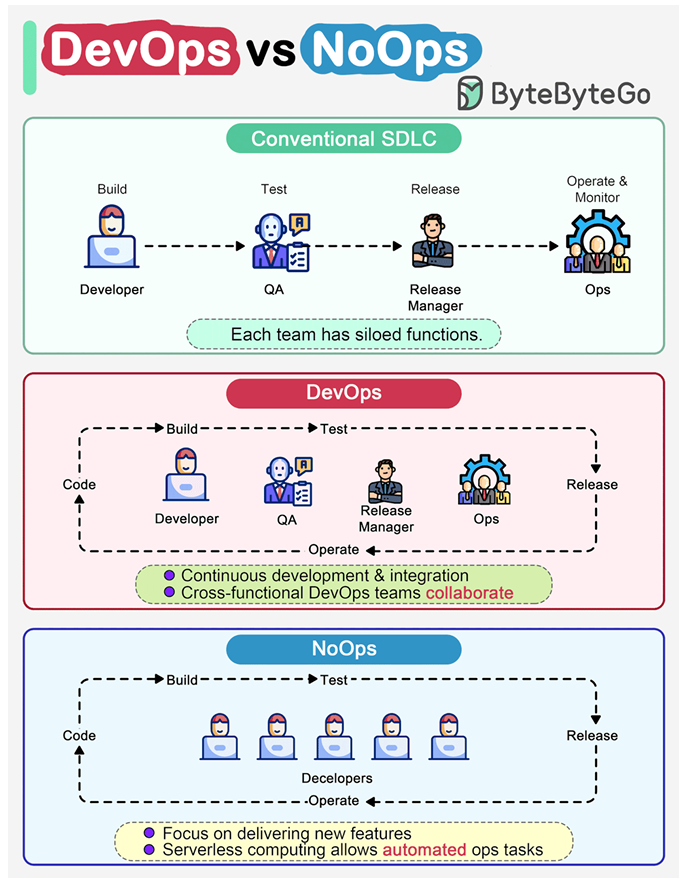

## 持续集成、持续交付和持续部署 CICD

最初是瀑布模型，后来是敏捷开发，现在是DevOps，这是现代开发人员构建出色的产品的技术路线。 随着DevOps的兴起，出现了持续集成（Continuous Integration）、持续交付（Continuous  Delivery） 、持续部署（Continuous Deployment） 的新方法。

传统的软件开发和交付方法正在迅速变得过时。从以前的敏捷时代，大多数公司会每月，每季度，每两 年甚至每年发布部署/发布软件。然而现在在DevOps时代，每周，每天，甚至每天多次是常态。

当SaaS正在占领世界时，尤其如此，您可以轻松地动态更新应用程序，而无需强迫客户下载新组件。很 多时候，他们甚至都不会意识到正在发生变化。开发团队通过软件交付流水线（Pipeline）实现自动 化，以缩短交付周期，大多数团队都有自动化流程来检查代码并部署到新环境。

CI/CD 是一种通过在应用开发阶段引入自动化来频繁向客户交付应用的方法。CI/CD 的核心概念是持续 集成、持续交付和持续部署。作为一个面向开发和运营团队的解决方案，CI/CD 主要针对在集成新代码 时所引发的问题

具体而言，CI/CD 可让持续自动化和持续监控贯穿于应用的整个生命周期（从集成和测试阶段，到交付 和部署）。这些关联的事务通常被统称为“CI/CD 管道”，由开发和运维团队以敏捷方式协同支持。

### 持续集成 (CI-Continuous Integration)

集成指将多位开发者的开发代码提交后,合并集成在一起,存放在代码库的过程,并且后续还会不断的迭代 更新代码

持续集成是指多名开发者在开发不同功能代码的过程当中，可以频繁的将代码行合并到一起并切相互不 影响工作。很多情况下每天都要进行几次，主要目的是尽早发现集成错误，使团队更加紧密结合，更好 地协作。

CI属于开发人员的自动化流程。成功的 CI 意味着应用代码的新更改会定期构建、测试并合并到共享存储 库中。该解决方案可以解决在一次开发中有太多应用分支，从而导致相互冲突的问题。

**持续集成强调开发人员提交了新代码之后，立刻进行构建、（单元）测试。**

根据测试结果，可以确定新代码和原有代码能否正确地集成在一起。通过持续集成可以自动编译、打 包、签名项目，配合单元测试可以实现持续集成+自动化测试。让工程师从重复而又枯燥的手动打包完全 解放出来，让工程师能更加专注于代码本身，最大限度的减少误操作风险，降低修复错误代码的成本， 大幅提高工作效率。

### 持续交付(CD-Continuous Delivery)

完成 CI 中构建及单元测试和集成测试的自动化流程后，持续交付可以自动的将已验证的代码发布到存储 库。为了实现高效的持续交付流程，务必要确保 CI 已内置于开发管道。**持续交付的目标是拥有一个可随 时部署到生产环境的代码库。**

持续交付在持续集成的基础上，将集成后的代码部署到更贴近真实运行环境的「类生产环境」 （production-like environments）中。比如，我们完成单元测试后，可以把代码部署到连接数据库的  Staging 环境中更多的测试。如果代码没有问题，可以继续手动部署到生产环境中。此方式是当前普遍 采用的方式

### 持续部署(CD-Continuous Deployment)

对于一个成熟的 CI/CD 管道来说，最后的阶段是持续部署。作为持续交付(自动将生产就绪型构建版本发 布到代码存储库)的进一步延伸，持续部署可以自动将应用发布到生产环境。由于在生产之前的管道阶段 没有手动风控，因此持续部署在很大程度上都得依赖精心设计的测试自动化。

实际上，持续部署意味着开发人员对应用的更改在编写后的几分钟内就能生效（假设它通过了自动化测 试）。这更加便于持续接收和整合用户反馈。总而言之，所有这些 CI/CD 的关联步骤都有助于降低应用 的部署风险，因此更便于以小件的方式（而非一次性）发布对应用的更改。不过，由于还需要编写自动 化测试以适应 CI/CD 管道中的各种测试和发布阶段，因此前期投资还是会很大。

持续部署是基于某种工具或平台实现代码自动化的构建、测试和部署到线上环境以实现交付高质量的产 品,持续部署在某种程度上代表了一个开发团队的更新迭代速率。

与持续集成相比，持续交付（CONTINUOUS DELIVERY）的侧重点在于交付，其核心对象不在于代码， 而在于可交付的产物。由于持续集成仅仅针对于新旧代码的集成过程执行了一定的测试，其变动到持续 交付后还需要一些额外的流程。与持续集成相比较，持续交付添加了测试Test->模拟Staging->生产 Production的流程，也就是为新增的代码添加了一个保证：确保新增的代码在生产环境中是可用的。

在持续交付的基础上，把部署到生产环境的过程自动化。如果你对比上图持续部署就可以发现持续部署 和持续交付的区别就是最终部署到生产环境是自动化的。因为自动发布存在较大的风险,当前采用此方式 较少

## Agile Model，CI/CD 和 DevOps 关系

DevOps 与 CICD 的联系与区别

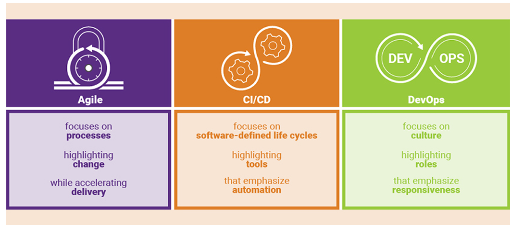

*   CICD是软件工程实践的方法，需要借助于各种工具来具体实现
*   DevOps是一种文化:也正是容器、容器编排、微服务等技术使得DevOps最终能够以应有的方式得 以落地
*   通常，在开发环境中自动化持续集成和持续交付(CI /CD)是DevOps团队的最终目标

## CICD 流程过程和架构

### 应用部署发展阶段

*   开发人员自行手动上传构建并部署代码

    早期项目,没有专业的运维人员,运维的工作由开发兼职完成,项目发布很不专业,很容易出错,也是最原 始的方式

*   开发人员先将代码发给运维,再由运维人员手动上传至生产环境

    专业的运维人员完成应用的部署,每次项目发布都由运维人员一步一步手动实现,效率低下且容易出 错

*   运维利用脚本和自动化运维工具实现部署

    由运维人员编写Shell,Python等脚本或利用自动化运维工具,如Ansible等实现半自动化应用部署,效 率很高,但对技术专业性有较高要求

*   通过 Web 等 GUI 界面实现一键自动化部署

    可以通过开源或自研的运维平台实现方便的应用部署,操作容易,效率高,但需要提前构建运维平台， 比如，Jenkins等

### CICD 流程

#### 传统方式的CICD 流程

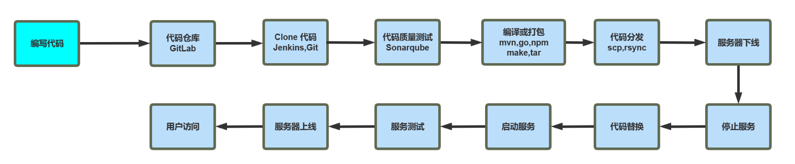

*   开发人员不断的进行代码提交到本地，再提交到运程的代码仓库服务器
*   Jenkins作为持续集成工具，使用Git工具到Git仓库拉取代码到集成服务器，代码测试与审查，再配 合JDK，Maven，Go等软件完成代码编译，测试，打包等工作，在这个过程中每一步如果出错，都 需要重新再执行一次整个流程。
*   Jenkins把生成的软件jar或war包等分发到测试服务器或者生产服务器，测试人员或用户就可以访问 应用。

#### 容器化方式的 CICD 流程

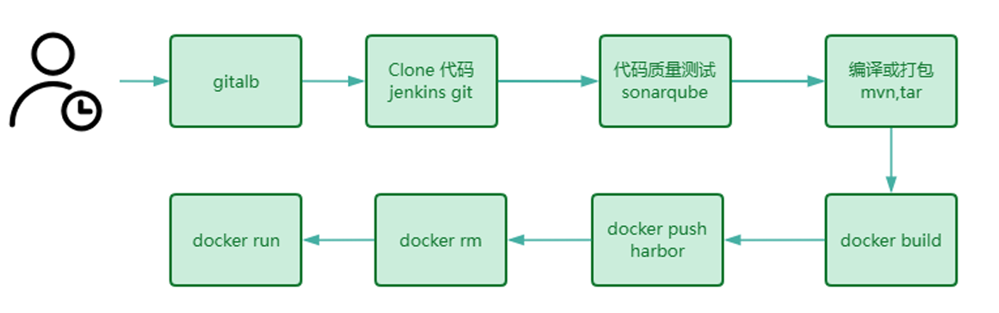

#### Kubernetes 环境的 CICD 流程

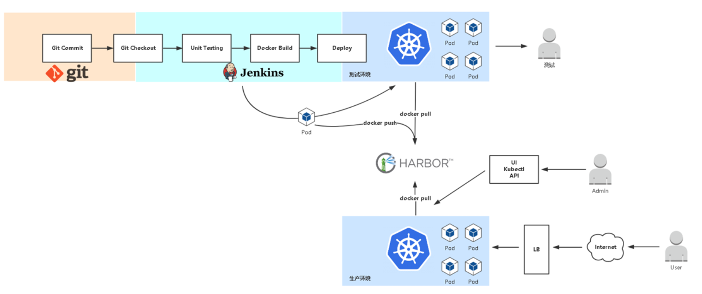

### CICD 相关工具

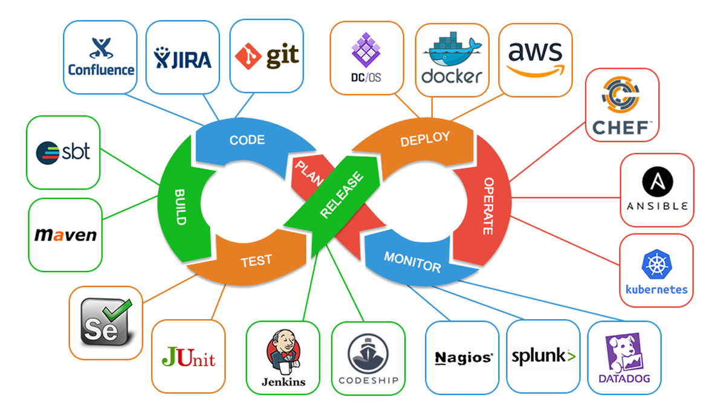

### CICD 基础架构

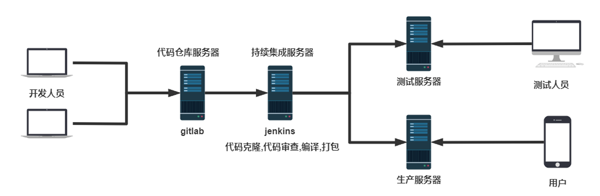

## 版本控制系统 VCS

*   版本控制（Version control）是维护工程蓝图的标准做法，能追踪工程蓝图从诞生一直到定案的过 程 
*   版本控制也是一种软件工程技巧，借此能在软件开发的过程中，确保由不同人所编辑的同一程序文 件都得到同步 
*   软件工程师常利用版本控制来跟踪、维护原始码、文档以及配置文件等的改动

软件版本控制的方法

*   最简单的情况下，软件设计师可以自己保留一个程序的许多不同版本，并且为它们做适当的编号
    *   这种简单的方法曾被用在很多大型的软件项目中 
    *   虽然可行，但效率较低 
    *   必须同时维护很多几乎一样的原始码备份，而且极度依赖软件设计师的自我修养与开发纪律
*   使用版本控制系统（Version Control System，VCS），实现部分或全部版本控制工作的自动化， 版本控制系统是一种软件，可以帮助软件团队的开发人员协同工作，并存档他们工作的完整历史记 录。

### 版本控制系统分类

*   本地版本(单机版)控制系统

*   集中式版本控制系统

    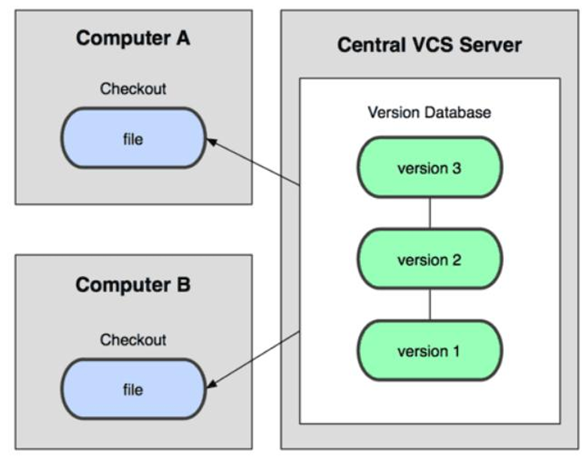

*   分布式版本控制系统

    *   在每个用户都有一个完整的服务器，用于保存软件的完整版本，然后再部署一个中央服务器

    *   用户可以先将代码提交到本地，没有网络也可以先提交到本地，然后在有网络的时候再提交到中央 服务器，这样就大大方便了开发者

        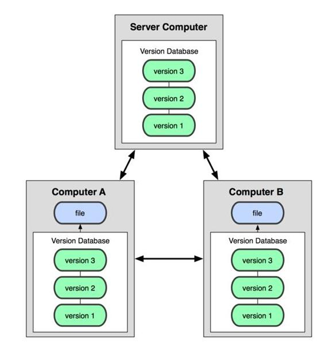

### 常见的版本控制系统

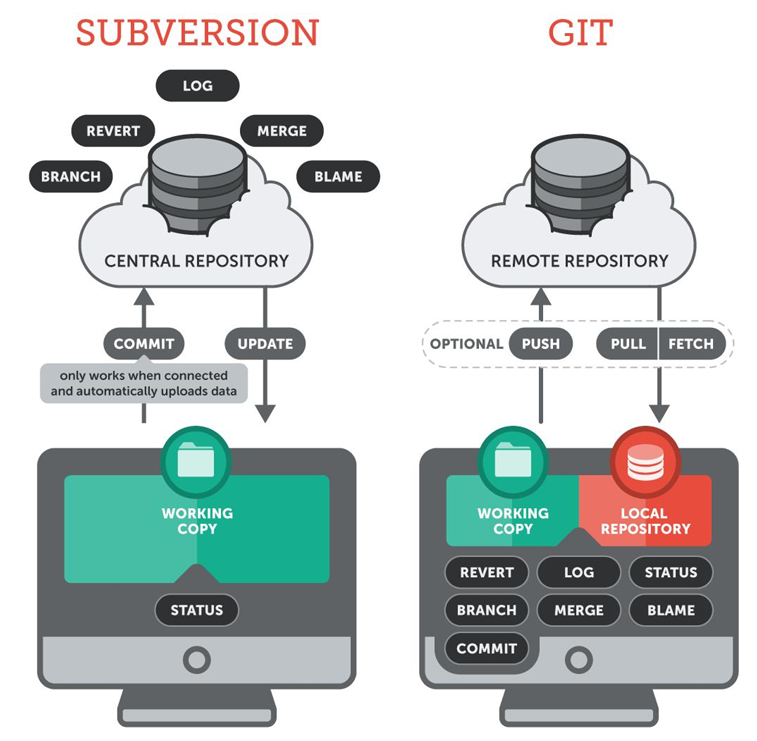

*   CVS(Concurrent Version System) 集中式版本控制系统

    *   由于 CVS 是集中式版本控制系统，所以它有客户端和服务端之区分。但要开始使用 CVS 的话，即使只在 你的本地机器上使用，也必须设置 CVS 的服务端。

*   SVN(Subversion) 集中式版本控制系统

    *   SVN 依赖于网络，需要在各个开发主机上安装客户端软件,并且在一台服务器集中进行版本管理和存储. 目前依然有部分公司在使用

        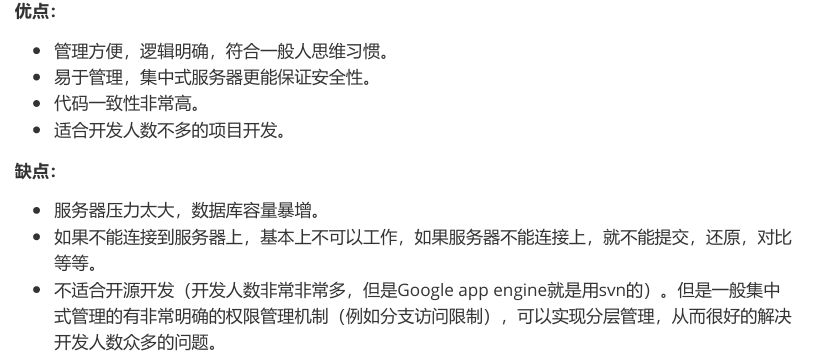

*   Git

    *   分布式版本控制工具

        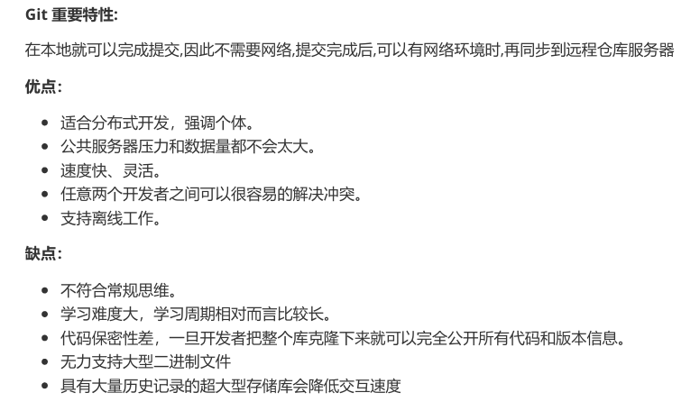

*   Github 网站

*   GitLab 网站和软件

    *   Github 提供了公有云的软件仓库服务，但实现私有仓库早期是收费的，而GitLab的出现解决了这一问 题。

## 常见的软件部署模式

### 蓝绿部署 Blue-green Deployments

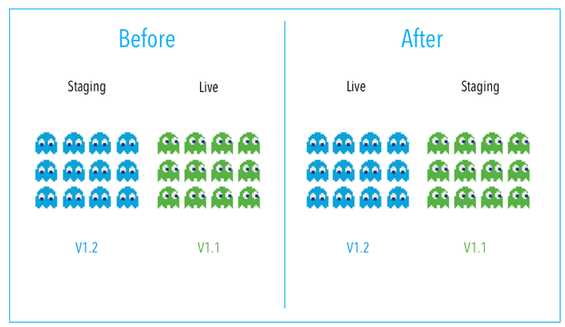

蓝绿部署指的是不停止老版本代码(不影响上一个版本访问)，而是在另外一套环境部署新版本然后进行测 试，测试通过后将用户流量切到新版本，其特点为业务无中断，升级风险相对较小。但本方式成本较高, 一般小公司较少使用

蓝绿色部署是一种部署策略，利用两种相同的环境，即"蓝色"（又名预发布）环境和"绿色"（又名生产） 环境，具有不同版本的应用程序或服务。质量保证和用户接受度测试通常在承载新版本或更改的蓝色环 境中进行。一旦蓝色环境中测试并接受新的变化，用户流量就会从绿色环境切换为蓝色环境。然后，一 旦部署成功，您可以切换到新环境

### 金丝雀(灰度)发布 Canary Deployment

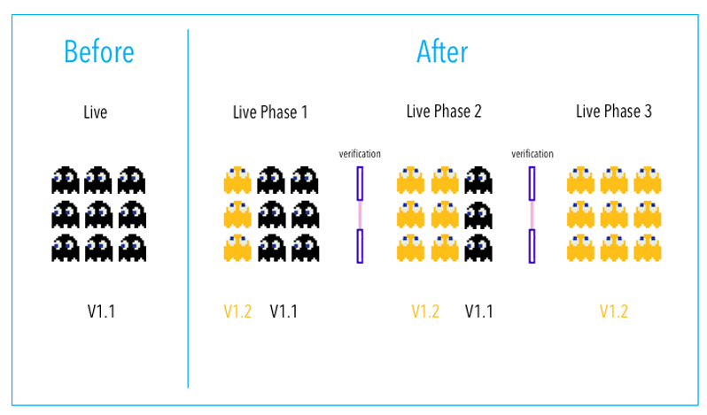

金丝雀发布也叫灰度发布，是指在黑与白之间，能够平滑过渡的一种发布方式，灰度发布是增量发布 （例如：2%、25%、75%、100%）进行更新)的一种类型，灰度发布是在原有版本可用的情况下，同时 部署一个新版本应用作为“金丝雀”(小白鼠)，测试新版本的性能和表现，以保障整体系统稳定的情况下， 尽早发现、调整问题。因此，灰度发布可以保证整体系统的稳定，在初始灰度的时候就可以发现、调整 问题，以保证其影响度。

此方式在实际生产中使用较为普遍

1.   准备好部署各个阶段的工件，包括：构建组件，测试脚本，配置文件和部署清单文件。
2.   从负载均衡列表中移除掉“金丝雀”服务器（选择全部服务器中的一部分）。
3.   升级“金丝雀”应用（排掉原有流量并进行部署）。
4.   对应用进行自动化测试。
5.   将“金丝雀”服务器重新添加到负载均衡列表中（连通性和健康检查）。
6.   如果“金丝雀”在线使用测试成功，升级剩余的其他服务器。否则就回滚回旧版本

### 滚动发布(更新)

滚动发布即逐步升级服务中的节点 滚动发布是指每次只升级一个或多个服务实例，升级完成后加入生产环境，不断执行这个过程，直到集 群中的全部旧版本升级新版本。

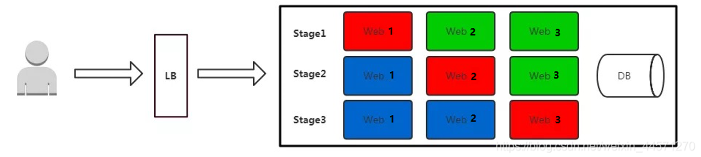

红色：正在更新的实例，正在升级过程中间状态

蓝色：更新完成并加入集群的实例,升级完成的新版本 

绿色：正在运行的实例，升级前的旧版本

### A/B测试 A/B Testing

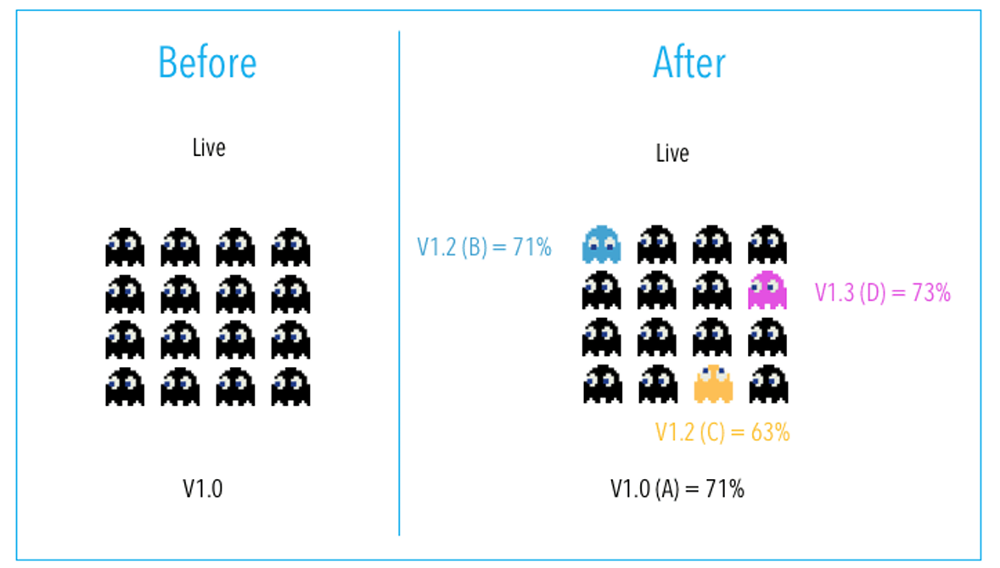

A/B测试即同时对外提供两个APP运行环境，这和蓝绿部署的同时只有一个版本在线是不同的

A/B 测试是用来测试应用功能表现的方法，例如可用性、受欢迎程度、可见性等等

蓝绿部署和A/B测试是不同的,蓝绿部署的目的是安全稳定地发布新版本应用，并在必要时回滚

即蓝绿部署是同一时间只有一套正式环境在线，而A/B测试是两套正式环境同时在线，一般用于多个产 品竟争时使用

# 版本控制系统 Git

**SVN 与 CVS：**

每次提交的文件都单独保存， 即按照文件的提交时间区分不同的版本， 保存至不同的逻辑存储区域，后 期恢复时候直接基于之前版本恢复。 将它们存储的信息看作是一组基本文件和每个文件随时间逐步累积 的差异 （它们通常称作基于差异（delta-based） 的版本控制）

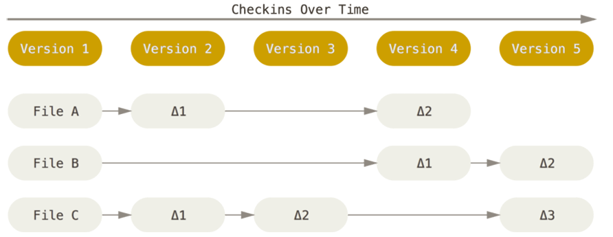

**Git:**

在 Git中，每当你提交更新或保存项目状态时，它基本上就会对当时的全部文件创建一个快照并保存这个 快照的索引。为了效率，如果文件没有修改，Git 不再重新存储该文件，而是只保留一个链接指向之前存 储的文件。 Git 对待数据更像是一个 快照流。

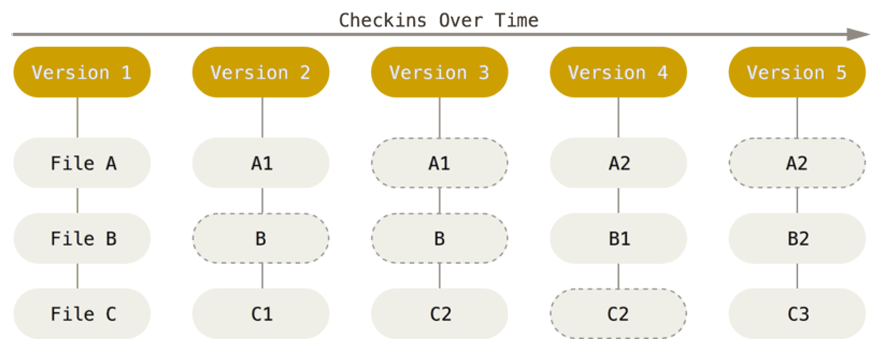

**git和SVN区别**

*   git是分布式的,svn是集中式的 
*   git是每个历史版本都存储完整的文件,便于恢复,svn是存储差异文件 
*   git可离线完成大部分操作,svn则不能 
*   git有着更优雅的分支和合并实现 
*   git有着更强的撤销修改和修改历史版本的能力 git速度更快,效率更高

## Git 相关概念和原理

### Git 的区域

Git 的数据存储从物理上分为当前项目目录和当前项目目录下的隐藏子目录.git，分别称为工作区和版本 库

Git 版本库逻辑上又分为暂存区和本地仓库

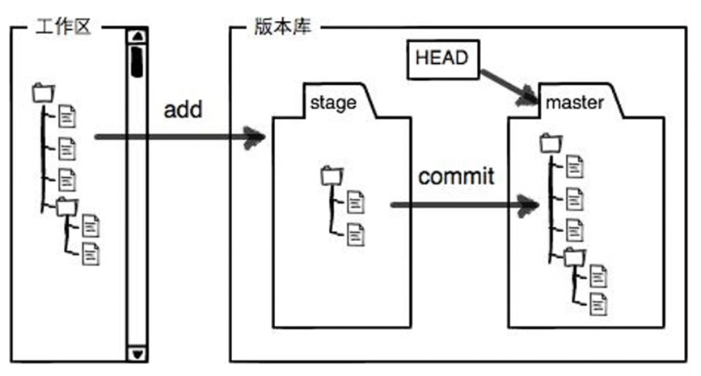

*   工作区 Workspace：

    工作区是你当前正在编辑和修改文件的地方。它是你的项目目录 ，通常是对应于<项目目录> 在这里你可以添加、修改或删除文件。工作区中的文件可以是已被Git跟踪的文件，也可以是未被 跟踪的文件。

    工作区中的文件的变更不受Git的跟踪和管理，无法实现版本回滚等功能

    需要将工作的的变更，通过 git add 命令加入暂存区后，才可纳入Git 的版本管理控制的范畴

*   暂存区 Staging Area/Index/Cached：

    也称为索引区,缓存区，用于存储在工作区中对代码进行修改后的文件所保存的地方，只有放入此区 的文件才能被git进行管理,使用 git add添加,对应为<项目目录>/.git/index文件

    暂存区主要用于临时保存文件少量变更，类似于邮件中的草稿箱

    当变更累积到一定阶段，希望生成里程碑式的结果时，会使用commit，将暂存区的变更一次性的 批量提交到本地仓库

*   本地仓库 Local Repository：

    用于存储在工作区和暂存区中改过并提交的文件地方，使用 git commit 提交,对应于/<项目目录 >/.git/

    每一次commit 会生成一个唯一的ID，通常用于表示一个阶段性的新的版本

    checkout命令执行了同commit命令相反的操作，它将版本中存储的commit所代表着的某个版本 恢复至工作区中

    checkout命令完成后，工作区中的文件内容与其检出的提交那一刻的状态相同

    若工作区中存储此前未被提交的新文件，这些文件的未被提交的新的更改会被存储仓库的旧内容覆 盖

    当然，用户也可以暂存这些新文件，并将带有新文件的工作区提交到版本库中，这将是新的暂存和 提交循环

*   远程仓库 Remote Repository ：

    多个开发人员共同协作提交代码的仓库，即私有 gitlab 服务器或公有云github,gitee网站等 利用远程仓库，可以实现异地备份和远程协作

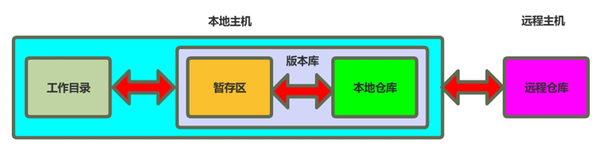

## Git 开发分支流程

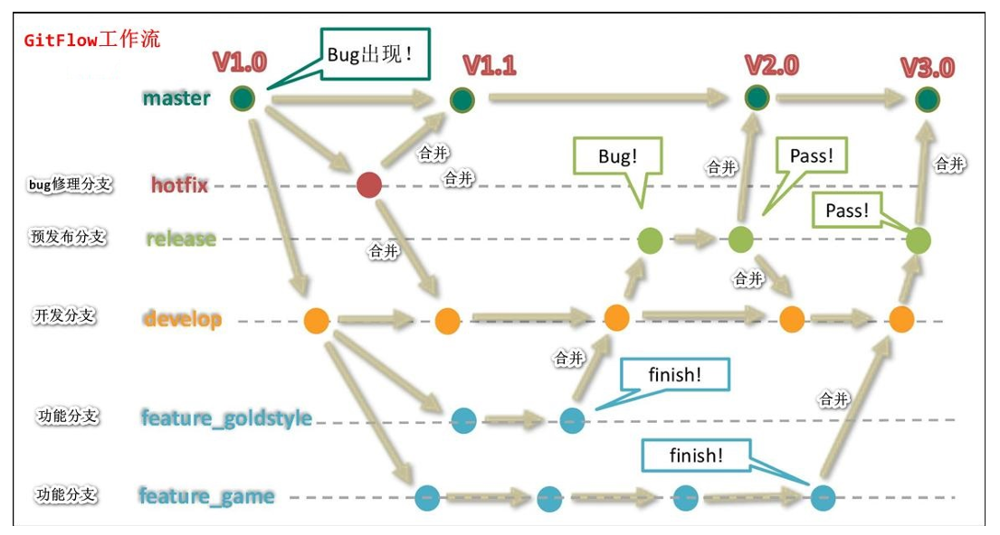

## Git 安装

### 二进制包安装

```shell
add-apt-repository ppa:git-core/ppa
apt update; apt install git
```

### 源码安装

```shell
sudo apt-get install dh-autoreconf libcurl4-gnutls-dev libexpat1-dev gettext libz-dev libssl-dev
sudo apt-get install asciidoc xmlto docbook2x
sudo apt-get install install-info
sudo ln -s /usr/bin/db2x_docbook2texi /usr/bin/docbook2x-texi

wget https://www.kernel.org/pub/software/scm/git/git-2.48.1.tar.xz
tar -Jxf git-2.48.1.tar.xz
cd git-2.48.1/
make configure
./configure --prefix=/usr
make all doc info
sudo make install install-doc install-html install-info
```

## Git 常用语法

[Git - Reference](https://git-scm.com/docs)

[Git](https://git-scm.com/book/zh/v2)

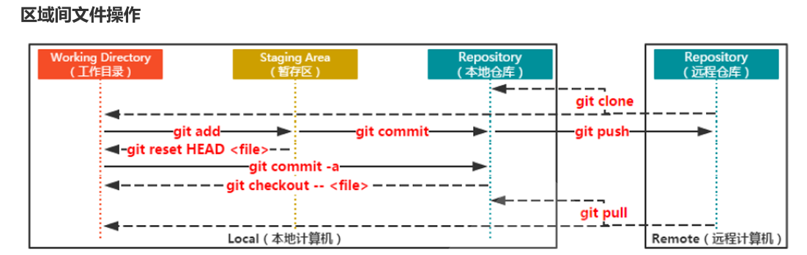

```shell
git version  #查看版本
git init       
#本地仓库初始化
git init --initial-branch=main  #初始化主分支为main，默认为master,注意:此为新版用法
git init --bare #创建无工作区的祼仓库,适用于充当远程仓库,一般对应的目录以.git为后缀

git clone <repository_url>  [workdir]      #克隆url指定的项目的所有分支和标签对应文件到指定目录（默认为当前目录）,并在本地创建此项目的git仓库，默认只显示master分支，而不晃示其它支支，但可以执行git checkout 分支，即可查看到其它分支的文件
git clone -b develop <repository_url>      #克隆url指定的项目,并切换到develop分支
git clone -b tag <repository_url>          #克隆url指定的项目，并切换到指定的tag

git config --global user.name "xxx" #设置当前用户的git全局用户名,和下面两项都存放在~/.gitconfig文件中
git config --global user.email "xxx@qq.com" #设置全局邮箱
git config --global color.ui true   #让Git显示颜色，会让命令输出看起来更醒目
git config --global core.editor vim #git默认的编辑器为nano，不常用，需要修改为vim
git config --global --list|-l  #列出用户全局设置,默认保存在~/.gitconfig文件中
git config --global -e #交互编辑配置

#文件操作
git add index.html / . #添加指定文件、目录或当前目录下所有数据到暂存区
git mv file_oldname file_newname    #将已经进入版本仓库的文件改名，注意：不支持在工作区没有存入暂存区的新创建的文件
git rm --cached file   #只删除暂存区的文件,不删除工作区文件,相当于git add 反操作，和git restore --staged 功能相同
git rm  file           #从删除工作目录和暂存区删除文件 
git checkout file      #从暂存区复制文件到工作目录
git restore --staged <file>     #新版EXPERIMENTAL命令,撤销add到暂存区的文件回到工作区，重新成为untracked状态
git restore <file>     #撤消已跟踪但尚未加入暂存区中的文件变更，撤消了工作区中文件的所有新的更改
git restore -s <commitid> <pathspec>  #从某个提交中恢复文件
                                      #示例：从前一次提交中恢复README.md文件：git restore -s HEAD~ READEME.md
                                      
#查看文件列表和内容
git ls-files           #查看暂存区文件,选项-s显示mode bits, object name and stage number,-o显示untracked文件 
git cat-file -p <blogid>  #查看仓库对象的内容,仓库对象存放在.git/objects目录下

#查看文件变化
git diff [<path>...]                            #对比工作区和暂存区的区别
git diff --staged|cached  [<path>...]           #对比暂存区和本地仓库的前一次提交的区别
git diff --cached <commit> [<path>...]          #对比暂存区与指定的提交
git diff [<commit>] [--] [<path>...]            #对比工作区和指定提交的文件的区别
git diff <commit>...<commit> [--] [<path>...]   #提交和提交之间的文件的区别

#提交
git commit -m  “comment“         #提交文件到工作区
git commit -am "comment"         #添加所有修改(不包括新文件)到暂存区并提交,相当于git add + git commit
git commit --amend --no-edit     #重新覆盖上次的提交
git commit --amend -m "comment"  #重新提交,覆盖上次的提交
git show [HEAD]                   #查看最近一次提交的详细信息,即查看HEAD当前所指向的commit的信息

#查看日志
git status #查看工作区的状态
git log #查看提交日志
git log --oneline #查看提交日志的简要信息，一个提交一行，只显示commit id的前七位
git log --oneline -N  #查看最近N条commit日志
git log  --pretty=oneline #查看提交日志的简要信息，一个提交一行，显示commit id 全部位
git log  --pretty=raw     #查看提交信息，包括对应的tree对象，父提交，作者等
git log --stats #查看提交的文件的统计信息
git log -p [commit_id] #查看指定提交和之前提交的变化详细信息
git log --author="<author-name-pattern>" #查看指定作者的提交
git log <file-pattern> #查看指定文件的提交
git log origin/main  #查看远程仓库的日志
git reflog  #查看分支或其它引用在本地仓库的完整历史记录

#回滚提交，本质上是将HEAD和master引用移到指定的commit上，是否基于指定的commit连同重置暂存区和工作区则取决于使用的选项
git reset --hard|soft|minxed HEAD^^  #git版本回滚， HEAD为当前版本，加一个^为上一个，^^为上上一个版本，也可以将^换成~
git reset --hard|soft|minxed HEAD~n  #回滚前n个版本，0表示当前commit，~或者~1表示前一个commit,即相当于HEAD^
git reset --hard|soft|minxed 5ae4b06 #回退到指定id的版本,使用 git reflog 获取每次提交的ID
git reset --hard|soft|minxed v1.0    #支持tag,此处的v1.0为tag

#分支管理
git branch #查看分支及当前所处的分支
git branch -av #查看所有本地和远程分支
git branch <分支名> #创建分支<分支名>
git branch <分支名> <commit_id> #基于指定提交创建新分支
git branch -d <分支名>  #删除分支
git branch -m dev develop #修改分支名dev为develop
git branch -M main #修改当前分支名称为main
git branch -r      #列出所有远程分支

#切换分支
git checkout <分支名>    #切换到已有的分支，HEAD也会自动指向目标分支上的最新提交
git checkout <tag>      #切换至指定标签，检出到标签，会导致分离头指针，且新创建的提交也将处于分离的状态
git checkout -b <分支名> #创建并切换到一个新分支
git checkout -b <分支名> origin/<分支名> #利用服务器远程仓库的分支，同步在本地创建分支
git checkout [<commit>]-- <file> ...   #找回在工作区删除的已存入暂存区或提交的文件
git merge master -m  <message>  #将master分支合并至当前分支,无选项-m, 则为交互式输入信息
git merge orgin/<branch_name>   
#将远程分支合并到本地当前分支，通常应该将存在映射关系（通常为同一个分支名称）的分支进行合并
git merge --abort          #取消合并
git switch <branchname>    #切换分支.是Git 2.23 版本引入的新命令,git switch 是一个只专注于分支切换的命令，而 git checkout 则是一个历史更久,有更多的用途。除了切换分支外，git checkout 还可以用于还原文件、切换到特定的提交、创建新的分支等更通用的命令
git switch -c <new-branch>      #切抽并创建分支,相当于git branch <new-branch> && git switch <new-branch>

#标签
git tag <tagname>                          #当前commit创建轻量标签
git tag <tagname>  <commit_id>             #将指定commit创建轻量标签
git tag -a <tagname>  -m <message>         #将当前commit创建附注标签
git tag -a <tagname>  -m <message> <commit_id>  #将指定commit创建附注标签
git tag -d <tagname>                    #删除标签
git reset --hard <tagname>              #回滚到指定标签
git tag                                 #查看标签
git tag -l [<pattern>]                  #查看指定模式的标签
git show <tagname>                      #查看指定标签详细信息

#远程仓库
git remote -v #查看远程仓库
git remote show <remote_name> #查看远程仓库详细信息，<remote_name>默认origin
git remote add <remote_name> <url> #创建远程仓库，<remote_name> 默认为origin
git remote add origin git@gitlab.example.com:testgroup/testproject.git #建立远程仓库和本地origin关联
git remote rename origin new-origin  #修改默认远程仓库名称origin为新的名称new-origin
git remote remove|rm origin #删除远程仓库的关联

#远程仓库推和拉
git push #将本地仓库提交代码到远程服务器
git push <remote_name> <branch_name> #推送指定分支到指定的远程仓库
git push origin master #将本地master分支推送到远程的 master 分支,和当前分支是否为master分支无关
git push origin dev    #将本地dev分支推送到远程的dev分支,如果远程没有dev会自动创建,和当前分支是否为dev分支无关
git push -u|--set-upstream origin master #将本地master分支推送到远程仓库master,-u表示以后可用git push 代替此命令
git push origin main:dev #将本地main分支推送至远程dev分支
git push origin :dev #将空分支推送到远程dev,即删除远程dev分支
git push <remote_name> --all #推送本地仓库的的所有有分支到远程 
git push -u origin --all     #推送所有分支
git push origin <tagname>       #推送本地仓库指定的tag到远程
git push origin --tag <tagname> #推送本地仓库指定的tag到远程
git push <remote_name> --tags          #将本地仓库所有的tag都推送到远程,默认不会推送标签
git push --delete origin <tagname> #删除远程仓库的标签
git pull               #从远程服务器获取所有分支的代码到本地仓库,并自动合并到本地仓库和工作区
git pull <remote_name> #拉取并合并远程分支变更到当前分支，相当于git fetch <remote_name> 和git merge <remote_name>
git pull origin dev    #从远程服务器指定的分支dev拉取代码到本地仓库,并自动合并到本地仓库和工作区
git fetch <remote_name> #获取远程仓库所有分支上的变更
git fetch <remote_name>   <branch_name> #获取远程仓库指定分支上的变更，但不合并
git fetch origin master #从远程仓库origin的master分支获取最新版本到本地仓库,但不合并至工作区，需要手动完成合并

#忽略文件，实现不跟踪指定文件
vim .gitignore #定义忽略文件，即不放在仓库的文件
```

### 创建项目并初始化配置

```shell
# 初始化
git init

#设置git，配置git的基本信息
#选项--system 表示针对所有用户的配置,保存在/etc/gitconfig文件中
#选项--global 表示当前用户环境,保存在~/.gitconfig文件中,推荐使用
#选项--local  表示只针对当前目录(项目)的配置,保存在当前目录的.git/config文件中，此为默认值，可省略
#优先级:local > global > system

 #用户名，另外还可以使用author.name标记作者，以及使用committer.name标记提交者
git config --global user.name xx
 #用户的邮箱，还可以使用author.email标记作者邮箱和使用committer.email标记提交者邮箱
git config --global user.email root@xxx.com

#配置git默认使用的文本编辑器,也可由环境变量GIT_EDITOR指定，且此变量的优先级更高
git config --global core.editor vim

 #查看system,global和local的配置
git config -l
cat .gitconfig
git config -l --global

#交互编辑配置
git config --global -e

#删除配置
git config --unset --system user.name
```

### 添加暂存区并提交数据

```shell
touch a.txt

# 添加暂存区
git add a.txt

# 提交数据
git commit -m 'add a.txt'

# 查看仓库状态
# 工作区和暂存区数据不一致,会显示红色的提示
# 暂存区和本地仓库数据不一致,会显示绿色的提示
git status
```

### 设置忽略文件

配置.gitignore文件让 Git 不再管理当前目录下的某些文件。 

生产中有如下几类文件可能需要忽略

*   程序运行时产生的临时文件 
*   程序连接数据库这一类的配置文件 
*   程序本地开发使用的图片文件 
*   其它不想被共享的文件

```
#cat .gitignore 
/bin
/target
.classpath
.project
.settings
*.h
!test.h
*.py[c|x]
```

### 将文件加入暂存区再取消添加

```shell
touch f1.txt

git add f1.txt

#查看暂存区文件
git ls-files
```

